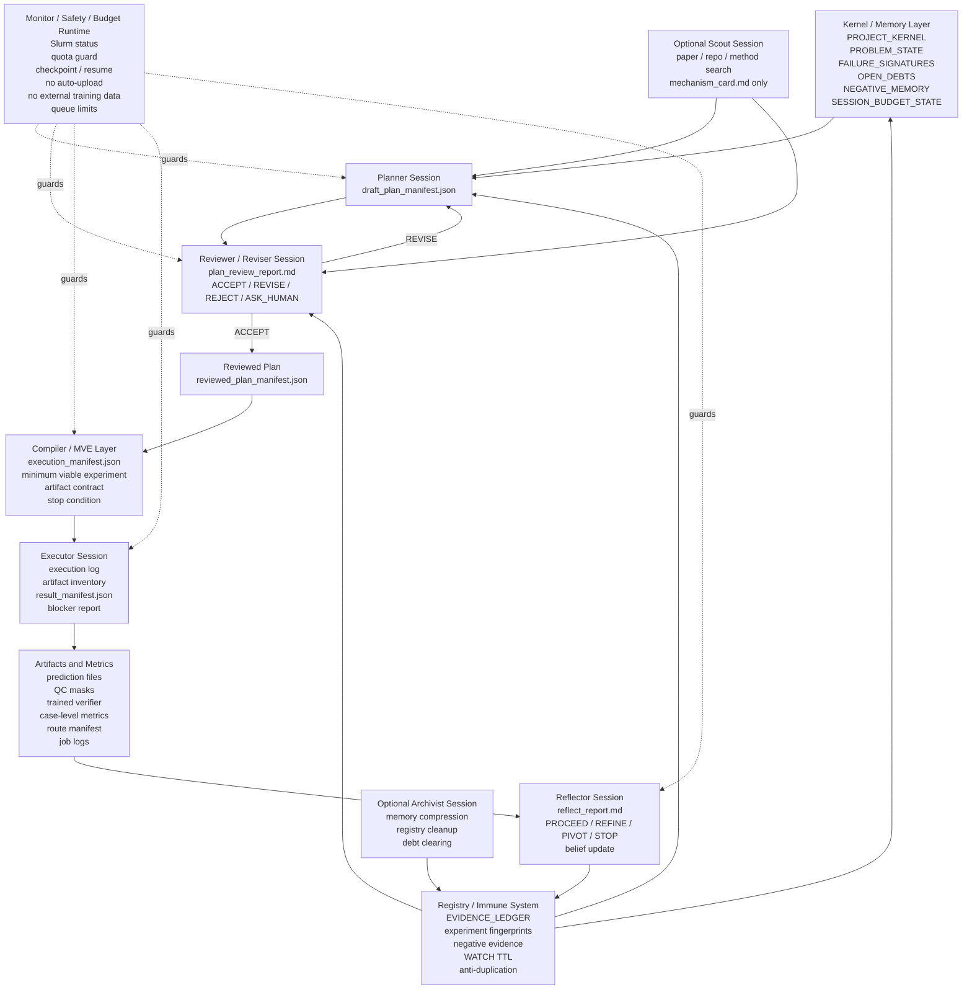

<h1 align="center">VibeResearch</h1>
<h3 align="center">A repository-local control layer for sustained research workflows</h3>

<p align="center">
  <strong>VibeResearch keeps planning, execution state, evidence, and reports inside each target repository's <code>.vibe/</code> directory.</strong>
</p>

<p align="center">
  <a href="README.md">English</a> |
  <a href="docs/README_CN.md">中文</a>
</p>

<p align="center">
  
  
  
</p>

---

## Overview

VibeResearch is a local-first framework for managing long-running research work
inside an existing code repository. It creates a `.vibe/` workspace in the
target repo and uses that workspace as the authoritative store for project
context, ideas, plans, run metadata, scheduler state, evidence, dashboards, and
daily notes.

The framework separates reasoning from execution. A human or coding agent can
write plans, reviews, hypotheses, and analysis notes. VibeResearch records the
state, validates contracts, schedules runs, tracks provenance, collects
metrics, and blocks unsafe automation when required information is missing.

Typical use cases include:

- keeping iterative research work reproducible across many cycles;
- connecting a project-specific training or evaluation script to a generic
  orchestration layer;
- running local or Slurm-backed experiments with explicit budget and readiness
  gates;
- tracking external baselines, scout evidence, internalization decisions, owned
  framework scaffolds, and champion/challenger optimization loops;
- preserving old failed attempts as historical evidence without trusting them
  automatically;
- producing status dashboards, daily memos, and meeting-ready summaries.

## VibeResearch OS Architecture

VibeResearch OS is not a wrapper around an external auto-research framework and
it is not a single super-agent that plans, approves, executes, and declares
success by itself. It is a session-oriented research operating system built
around separated Codex sessions, shared files, evidence levels, negative
memory, and budget-aware runtime rules.

The design goal is not to make agents look busy. Each research cycle must
produce auditable evidence, a belief update, negative evidence, or a concrete
next debt. An action that cannot move from idea to artifact, then to metric and
decision, is preparation or diagnostics; it is not research progress.

### Design Principles

- Separate duties before increasing autonomy. Planning, reviewing, executing,
  and reflecting are different responsibilities and should run in different
  Codex sessions.
- A plan cannot approve itself. The Reviewer Session is the execution gate
  before Slurm, code changes, or expensive experiments.
- Artifacts are not enough. Every artifact must support an evidence type and a
  belief update.
- Failed routes are immune memory, not ordinary logs. Similar future plans must
  explain their new mechanism or be rejected.
- Budget and safety are runtime constraints. They are not reminders in a prompt.

### Layers And Sessions

The architecture has eight layers. A layer is an architectural concern; a
session is an operating role that may be run by Codex.

1. Kernel / Memory Layer: stores the project goal, problem state, failure
   signatures, open debts, negative memory, safety boundaries, and budget state.
2. Planner Layer: proposes candidate plans and bold mechanisms.
3. Reviewer / Reviser Layer: reviews plans before execution, as a human mentor
   or reviewer would.
4. Compiler / MVE Layer: compiles accepted plans into minimum viable
   experiments and execution manifests.
5. Executor Layer: uses Codex to edit code, write runners, submit Slurm jobs,
   and produce artifacts and metrics.
6. Monitor / Safety / Budget Layer: provides Slurm monitoring, quota guards,
   checkpoint/resume, safety rules, and queue limits.
7. Reflector / Belief Ratchet Layer: interprets results after execution and
   returns `PROCEED`, `REFINE`, `PIVOT`, or `STOP`.
8. Registry / Immune System Layer: records fingerprints, negative evidence,
   WATCH TTL, and anti-duplication logic.

The minimum standing configuration has four Codex sessions:

- Planner Session: writes `draft_plan_manifest.json`; it cannot edit code,
  submit Slurm jobs, or approve its own plan.
- Reviewer Session: read-only review and revise; it writes
  `plan_review_report.md` and `reviewed_plan_manifest.json`, and returns
  `ACCEPT`, `REVISE`, `REJECT`, or `ASK_HUMAN`.
- Executor Session: executes reviewed manifests; it may edit code, run scripts,
  and submit Slurm jobs, but it cannot change the scientific direction or count
  smoke tests as progress.
- Reflector Session: reads results, interprets metrics, updates memory and
  negative evidence, and cannot run extra experiments.

Two sessions are optional and should be opened only when needed:

- Scout Session: searches papers, repositories, leaderboards, or new methods.
  Its only output is a `mechanism_card.md`; it cannot enter the execution queue.
- Archivist Session: compresses long-term memory, maintains registry state, and
  clears WATCH debts; it does not execute experiments.

Planner drafts are created explicitly with `vibe planner draft` and checked
with `vibe planner validate`. A draft must include a failure anchor, hypothesis,
mechanism, minimum experiment, expected artifact, expected belief update,
compute cost, risk, fallback, and stop condition before it can be reviewed.
Reviewer checks run through `vibe reviewer review`; only an `ACCEPT` verdict
writes `reviewed_plan_manifest.json` for the Compiler.
When Reviewer returns `REVISE`, `vibe reviewer revision-packet` creates the
structured revision request and `vibe planner resubmit` may update only the
requested draft fields.
Accepted reviewed plans are compiled with `vibe compiler compile`, which writes
`execution_manifest.json`, a local script draft, a Slurm draft, expected
artifact inventory, evaluation command, stop condition, and fallback command.
Every compiled manifest includes an MVE contract. `vibe mve validate` checks
the contract before execution, and `vibe mve promote-success` records the next
evidence debt instead of declaring mainline success.
Executor runs are started with `vibe executor run` against an accepted
`execution_manifest.json`. Executor writes an execution log, artifact inventory,
result manifest, and Reflector-readable result report; failed commands or
missing expected artifacts produce a blocker report instead of a completed run.
`vibe executor guard` checks the same entry boundary without running commands:
review approval consistency, evidence-grade artifacts, safety red lines, stop
condition, fallback command, and failure-report path.
Post-execution interpretation runs through `vibe reflector reflect`. Reflector
reads the Executor result manifest, artifact inventory, metric artifact, logs,
and MVE contract, then writes `reflect_report.md` with `PROCEED`, `REFINE`,
`PIVOT`, `STOP`, or `ASK_HUMAN`. MVE success creates promotion debt rather than
mainline success, and smoke/import success remains feasibility evidence.
`vibe ratchet apply` turns that reflection into layered belief memory:
feasibility, mechanism, metric, robustness, and negative evidence are recorded
separately so a useful mechanism can be preserved even when a headline metric
does not improve.
`vibe registry record` and `vibe registry check` maintain the immune system:
plans are fingerprinted by failure anchor, mechanism, action type, artifact
type, metrics, review/reflect decisions, and evidence type. Renamed repeats are
blocked unless they introduce a new mechanism, information source, artifact, or
evidence path.
`vibe debt list` and `vibe debt clear` bound WATCH/REFINE debt: every open debt
records the missing evidence, repayment MVE, TTL, promotion condition, pivot
condition, stop condition, and owner session. Expired debt becomes STOP negative
memory or a PIVOT plan seed that must return through Reviewer.
`vibe scout mechanism-card` and `vibe planner draft-from-card` route external
knowledge through mechanism extraction before planning. Papers, repositories,
deep research notes, and user ideas must become a `mechanism_card.md` with a
possible MVE before Planner/Reviewer/Compiler can turn them into execution
manifests; clone or install steps alone are not experiment goals.
When a validated mechanism card reaches `PLAN_CANDIDATE`, regular cycle
planning consumes it before falling back to generic baseline/diagnostic
templates. The cycle state, `portfolio_plan.md`, `resource_plan.yaml`, Codex
prompt context, and dashboard status all carry the card id, source, required
assets, stop reason, active adapter surface, and expected metric artifact.
If a run still carries research metadata for an unregistered `experiment_id`,
collect records `research_evidence_link_skipped` and keeps the metrics instead
of crashing after execution.
`vibe knowledge audit` and `vibe knowledge advance-ttl` enforce No Orphan
Knowledge. Active repo, paper, deep-note, mechanism-card, and user-idea inputs
expire after two cycles unless they become an active mechanism, negative
evidence, or archived reference; expired orphans are recorded in the registry.
`vibe os-beta run` executes a toy closed-loop harness across Planner, Reviewer,
Compiler, Executor, Reflector, Registry, Ratchet, and next Planner artifacts. It
checks role boundaries, budget guards, duplicate blocking, debt clearing, and
low-quota resume behavior without running a downstream CARE round.
`vibe anti-stall run` scores trap handling for generic U-Net reruns,
negative-memory repeats, clone-only repo work, one-case evidence promotion,
smoke-only feasibility, WATCH debt clearing, orphan knowledge clearing,
registry duplicate blocking, role boundaries, and low-quota checkpoint/resume.
`vibe brief update` maintains a Living Research Brief for humans and future
dashboards. It writes `.vibe/research/CURRENT_RESEARCH_BRIEF.zh.md`,
`.vibe/research/CURRENT_RESEARCH_BRIEF.en.md`, and
`.vibe/research/research_brief.json`; `research.brief_language` selects the
preferred language. The brief is not a log. It summarizes the current project
goal, failure signatures, recent positive and negative evidence, active route,
open evidence debt, user-decision needs, active human guidance, and unconsumed
mechanism cards from local evidence files. It must not turn smoke/import/clone
checks into real progress or upgrade WATCH into GO.
`vibe guidance add` records Human Idea Inbox entries in
`.vibe/research/human_guidance.jsonl` and renders
`.vibe/research/HUMAN_IDEA_INBOX.md`. Each record stores timestamp, source,
raw text, language, priority, linked failure signature, suggested mechanism,
status, review decision, applied plan, supersession, and notes. `vibe idea`
also writes this inbox. Planner drafts list which active guidance was absorbed
or left unused; Reviewer revises plans that ignore active guidance without an
explanation; Reflector updates guidance after evidence is observed.



### Standard Workflow

The workflow is not "Codex writes a plan and then runs it." The standard loop
is:

1. The Problem Kernel fixes the goal, failure signatures, open debts, negative
   evidence, budget state, and safety boundaries.
2. The Planner Session reads that state and writes `draft_plan_manifest.json`.
   Each candidate states its failure anchor, hypothesis, mechanism, expected
   artifact, expected belief update, minimum experiment, cost, fallback, and
   stop condition.
3. The Reviewer Session reads the draft and registry, then writes
   `plan_review_report.md`. It returns `ACCEPT`, `REVISE`, `REJECT`, or
   `ASK_HUMAN`. Only accepted plans become `reviewed_plan_manifest.json`.
4. The Compiler / MVE Layer turns the reviewed plan into `execution_manifest.json`.
5. The Executor Session runs the accepted manifest, records command provenance,
   artifact inventory, result reports, and blocker reports, and cannot rewrite
   the reviewed scientific decisions.
6. Monitor / Safety / Budget Runtime watches jobs cheaply, enforces queue and
   quota limits, and writes checkpoints before interruption.
7. The Reflector Session reads the outputs and writes `reflect_report.md` with
   `PROCEED`, `REFINE`, `PIVOT`, or `STOP`.
8. Registry and memory files are updated. The next Planner cycle starts from
   the updated belief state, not from a blank prompt.

There are two revising gates. Pre-execution revise is done by Reviewer and
prevents wasted compute. Post-execution revise is done by Reflector and updates
research belief.

### Shared File Protocol

Sessions hand off through files, not through chat memory. In the installed
framework these kernel files live under `.vibe/kernel/`, and `vibe kernel`
commands initialize, inspect, append evidence, and check protocol boundaries:

- `PROJECT_KERNEL.md`: long-term goal and absolute boundaries.
- `PROBLEM_STATE.md`: current state of the research problem.
- `FAILURE_SIGNATURES.md`: concrete failure modes currently being attacked.
- `OPEN_DEBTS.md`: unresolved research debts, WATCH items, and required next
  evidence.
- `NEGATIVE_MEMORY.md`: failed mechanisms and routes that should not be
  repeated without a new mechanism.
- `EVIDENCE_LEDGER.jsonl`: append-only evidence, decisions, artifact pointers,
  and belief updates.
- `SESSION_BUDGET_STATE.json`: Codex quota, weekly quota, active session,
  running jobs, resume command, and checkpoint path.
- `draft_plan_manifest.json`: written by Planner.
- `plan_review_report.md` and `reviewed_plan_manifest.json`: written by
  Reviewer.
- `execution_manifest.json`: written by Compiler.
- `artifact_inventory.json`, metrics CSVs, and job logs: written by Executor.
- `reflect_report.md`: written by Reflector.

The kernel command surface is intentionally small:

- `vibe kernel init`: create or repair required kernel files.
- `vibe kernel status`: verify a new session can recover state from files.
- `vibe kernel roles`: list Planner, Reviewer, Compiler, Executor, Reflector,
  Scout, and Archivist role boundaries.
- `vibe kernel check-role`: preflight a role action, output path, and budget
  state before mutation or execution.
- `vibe kernel record-evidence`: append an auditable evidence ledger row.
- `vibe kernel check-protocol`: detect missing files and closed-loop role
  violations.

### Anti-Stall Rules

VibeResearch avoids laziness structurally:

- A plan without a failure anchor cannot enter Reviewer.
- A plan without an expected artifact and expected belief update cannot be
  accepted.
- A repository or paper that cannot become a mechanism card and MVE cannot
  enter the execution queue.
- Smoke, import, clone, metadata, cache, and readiness checks are diagnostic
  evidence only. They are not progress evidence.
- Every WATCH must state the next debt and TTL; expired WATCH items become
  `STOP` or `PIVOT`.
- A renamed version of an old failed experiment is blocked by Registry unless
  it introduces a new mechanism, information source, artifact, or evidence path.
- A one-case positive result cannot jump to submission. It must promote through
  subset, fold0, and then multi-fold or packaging evidence.

### Evidence Promotion

Evidence has levels:

- Feasibility evidence: proves whether something can run, such as import/load
  or shape checks.
- Mechanism evidence: shows that a mechanism may work, such as a one-case
  component veto.
- Metric evidence: shows metric movement, such as subset or fold0 Dice/HD95.
- Robustness evidence: shows stability across cases, centers, folds, or
  protected metrics.
- Negative evidence: shows which routes should not be repeated.

The normal promotion ladder is feasibility -> one-case -> subset -> fold0 ->
multi-fold or packaging. The system cannot jump from smoke to success.

### Budget-Aware Runtime

All Codex sessions are quota-aware. Each session reads
`SESSION_BUDGET_STATE.json` before starting work, before long tasks, before
revision, before reflection, and before sleep or resume.
`vibe session-budget init` creates the shared state, `vibe session-budget
refresh` records manually observed `codex --no-alt-screen` `/status` quota
text, and `vibe session-budget guard --phase PLAN|REVIEW|COMPILE|EXECUTE|REFLECT|SLEEP`
decides whether the next phase is allowed.

When the 5-hour quota is below 20%, sessions may only close work, write
checkpoints, submit an already prepared short job, summarize results, or update
memory. When it is below 10%, sessions must stop new reasoning, write
`RESUME.md`, record the current phase, next command, open debts, job id, and
actions that must not be repeated, then sleep or exit until renewal. Use
`vibe session-budget checkpoint --phase ...` to write that recovery state.

Executor has priority at low quota because it must preserve the engineering
state. Reflector is next because it preserves interpretation. Planner and
Reviewer should pause. During long Slurm jobs, Codex should not repeatedly read
logs; zero-cost shell monitoring should wait for the job and leave a resume
command. `vibe session-budget wait-mode --wait-type slurm-job` records job
polling, while `--wait-type quota-wait` records a quota renewal wait using
`wait_until_budget_reset.sh`.

### Codex Roles

Codex can serve as Planner, Reviewer, Executor, or Reflector, but those roles
must run in separate sessions with separate permissions. Codex is most useful
as Executor because it can read code, edit code, write scripts, fix errors,
submit Slurm jobs, and organize artifacts. Codex can also serve as Reviewer,
but only in a read-only Reviewer Session. The same session must not propose,
approve, execute, and declare success.

Reviewer is the most important anti-stall gate. Without it, the system tends to
confuse "can run" with "worth running."

### Version Roadmap

The post-0.12 roadmap is VibeResearch's own OS architecture, not a wrapper
around an external auto-research framework:

- 0.13: session-oriented kernel and shared file protocol.
- 0.14: Planner, Reviewer, and revision loop.
- 0.15: Compiler and MVE contract.
- 0.16.0-0.16.1: Executor session and boundary guard.
- 0.16.2: Budget-Aware Session Runtime.
- 0.17: Reflector and Belief Ratchet.
- 0.18: Research Registry, Immune System, and WATCH TTL.
- 0.19: Knowledge-to-Experiment pipeline.
- 0.20: VibeResearch OS Beta, Anti-Stall Benchmark, prompt-regression closure,
  and the CLI/file-protocol implementation of Living Research Brief plus Human
  Guidance Inbox. In particular, 0.20.3 implements the v0.19 manual prompt for
  persistent research-state summaries and user guidance intake.

### Minimal Operating Procedure

1. Open a Planner Codex session. It may only generate
   `draft_plan_manifest.json`.
2. Open a Reviewer Codex session. It may only generate
   `plan_review_report.md` and `reviewed_plan_manifest.json`.
3. Open an Executor Codex session. It may only run a reviewed
   `execution_manifest.json`.
4. Open a Reflector Codex session. It reads results and updates
   `reflect_report.md`, `NEGATIVE_MEMORY.md`, `OPEN_DEBTS.md`, and
   `EVIDENCE_LEDGER.jsonl`.
5. If new papers, repositories, or methods must be searched, open a temporary
   Scout Session.
6. If memory or registry state becomes noisy, open a temporary Archivist
   Session.

## Installation

Install from a clone of this repository:

```bash
git clone https://github.com/YuukiAS/VibeResearch.git
cd VibeResearch
python -m pip install -e .
```

Check that the command line interface is available:

```bash
vibe --help
vibe bootstrap --help
```

## Quick Start

Initialize a target research repository:

```bash
cd /path/to/research-repo
vibe init \
  --goal "Improve validation performance under a fixed evaluation protocol" \
  --background "Project context, data, metrics, compute limits, and current baseline"
```

GPU/Slurm resource policy is initialized by default. VibeResearch writes
`.vibe/resources/` and `.vibe/config.detected.yaml` during `vibe init`, but it
does not assume that names such as `a100-gpu` or `volta-gpu` imply a specific
GPU model. During onboarding, inspect the target cluster and pass the selected
policy explicitly when it is known:

```bash
sinfo -h -o "%P %G"

vibe init \
  --goal "..." \
  --background "..." \
  --preferred-partition lab-gpu \
  --fallback-partition a100-gpu \
  --partition-gres 'a100-gpu=gpu:nvidia_a100-pcie-40gb:{gpu}' \
  --max-pending-start-plus-run-hours 12 \
  --max-run-hours 8 \
  --max-epochs 120 \
  --delivery-max-run-hours 72 \
  --delivery-max-epochs 5000
```

The partition names above are examples only. Use the names and GRES templates
reported by the target site. If the project is CPU-only, record that answer in
the resource questions rather than skipping resource initialization. The normal
runtime cap is for exploratory experiments; the delivery cap is only for
explicitly marked final delivery or submission-stage runs.

Inspect the state:

```bash
vibe config validate
vibe status
vibe next
```

If the target repository should not receive generated root-level mirror files,
use:

```bash
vibe init --no-root-portal --goal "..." --background "..."
```

## Agent-Assisted Onboarding

For a new downstream repository, you can let Codex perform the installation and
bootstrap loop instead of following this README manually. Give Codex the prompt
in:

```text
docs/bootstrap/CODEX_ONBOARDING_PROMPT_CN.md
```

That prompt instructs Codex to clone VibeResearch from GitHub, install it, ask
for the required project goal and background, run bootstrap, summarize blockers,
write your answers into the target repository's `.vibe/` files, and resume the
initialization until a safe minimum capability is ready or explicitly blocked.

## Repository State Layout

VibeResearch keeps durable state under `.vibe/`:

```text
.vibe/
  project/                 project brief and initialization context
  config.yaml              framework configuration
  adapter.yaml             project capability contract
  adapter_questions.yaml   questions required before activation
  script_bootstrap_plan.md project wrapper plan
  scripts/                 project-owned wrapper scripts
  contract_tests/          adapter contract-test results
  policies/                budget, stage-gate, and autonomy policy
  state/                   scheduler and control state
  cycles/                  cycle-level plans and decisions
  runs/                    run manifests and provenance
  scheduler/               queue and budget state
  ideas/                   maintained idea pool
  research/                hypotheses, experiments, evidence, decisions
  memos/                   daily research notes
  dashboard/               machine-readable dashboard exports
  site/                    generated static dashboard
  reports/                 meeting and development reports
  portal/                  source for root-level generated mirrors
```

Root files such as `RUN.md`, `VIBE_STATUS.md`, `VIBE_TODO.md`,
`VIBE_TIMELINE.md`, and `VIBE_LEADERBOARD.md` are generated mirrors. The source
of truth remains under `.vibe/`.

Rebuild the mirrors with:

```bash
vibe portal build
```

VibeResearch does not modify a root `AGENTS.md` unless you ask it to:

```bash
vibe init --install-agents-snippet --goal "..." --background "..."
```

## Bootstrap And Readiness

The bootstrap workflow connects an existing project to VibeResearch in stages.
It discovers project files, drafts an adapter and wrapper plan, writes policy
files, records unanswered questions, runs validation, and activates only
capabilities that pass contract tests.

```bash
vibe bootstrap init --goal "..." --background "..." --memo-language zh-CN
vibe bootstrap run
vibe bootstrap status
vibe bootstrap doctor
```

If bootstrap stops on missing information, answer or edit the generated files
under `.vibe/`, then resume:

```bash
vibe bootstrap resume
```

Important outputs:

```text
.vibe/bootstrap/state.json
.vibe/bootstrap/sessions/<session_id>.json
.vibe/bootstrap/readiness_report.md
.vibe/bootstrap/readiness.json
.vibe/script_readiness.json
.vibe/dashboard/readiness_export.json
```

Readiness is intentionally conservative. Missing budget policy blocks queue
submission; missing autonomy policy blocks automatic execution; missing
stage-gate policy blocks promotion; missing protected metrics blocks automatic
higher-stage promotion.

Bootstrap and adapter discovery use a bounded file walker. Runtime-heavy
directories such as `.git/`, `.vibe/`, `.vibe_dogfood/`, `data/`, `results/`,
`models/`, `logs/`, `envs/`, and `external_supervisors/` are pruned before
descent. Project-specific limits can be set in `.vibe/config.yaml`:

```yaml
discovery:
  skip_dirs: [scratch, downloads]
  max_files: 200
  max_dirs: 1000
  max_seconds: 5
```

## Adapter Onboarding

The adapter is a project-specific contract that declares what VibeResearch is
allowed to do. Execution scripts are thin wrappers owned by the downstream
repository. The main VibeResearch package does not contain project-specific
training, evaluation, or submission logic.

Common adapter commands:

```bash
vibe adapter discover
vibe adapter draft
vibe adapter ask
vibe script bootstrap --plan
vibe adapter lint
vibe adapter doctor
```

Only `active` capabilities can be selected for execution. Draft, candidate, or
blocked capabilities appear in reports but cannot run. A capability becomes
active only after its contract test passes:

```bash
vibe adapter contract-test metrics_export
vibe adapter activate metrics_export --confirm "reviewed by project owner"
```

Generated wrappers in `.vibe/scripts/` are draft and untrusted until reviewed or
replaced by the downstream project. A safe onboarding sequence usually activates
evaluation or metrics export before any training or long-running job capability.

Instrumentation readiness is separate from real-experiment readiness. Probe
capabilities such as environment, data, and baseline inventory can verify the
project surface, but they do not count as method or evaluation experiments.
Use the real-experiment gap report to finish the project-specific contracts:

```bash
vibe adapter real-gaps
vibe experiment real-progress
```

## Bounded Research Management

The research manager tracks hypotheses, experiments, evidence, decisions,
budgets, and daily notes. It lets a project iterate over research ideas while
preserving the evidence chain that led to each decision.

```bash
vibe research init --goal "..." --background "..." --memo-language zh-CN
vibe hypothesis create "try a calibrated evaluator" --stage analysis
vibe experiment create hyp_001 --design "calibration smoke" --stage analysis --capability metrics_export
vibe experiment analyze exp_001 --trusted --schema-valid --summary "primary improved without guardrail regression"
vibe memory build
vibe portfolio plan
vibe portfolio schedule
vibe budget status
vibe memo daily --language zh-CN
vibe dashboard export-research
```

Promotion requires trusted, schema-valid evidence and no unacceptable protected
metric regression. Stopping requires trusted negative evidence or an explicit
user decision. Duplicate experiments, unknown cost, missing scripts, missing
metrics schemas, and unsupported capabilities are blocked before execution.

## Lineage, Scout, And Owned Frameworks

VibeResearch can record how a project moves from external tools toward owned
implementation. It separates five cases that should not be conflated: calling an
external repository, wrapping an external capability, using an external idea as
inspiration, shadowing an internal implementation, and treating a candidate as
owned core.

Useful lineage and internalization commands:

```bash
vibe lineage add-external-asset --asset-type repo --name baseline_repo --source https://example.org/repo
vibe lineage link --source-id asset_001 --target-id hyp_001 --relation-type supports
vibe internalization propose --title "owned evaluator" --external-baseline-asset-id asset_001 --downstream-src-target src/owned_eval
vibe internalization readiness proposal_001
vibe internalization memory
```

Scout evidence is structured before it can influence experiments or
internalization. Findings are scored for relevance, specificity, actionability,
novelty, credibility, implementation detail, and failure-mode fit. Background
reading is preserved, but it does not automatically become an experiment.

```bash
vibe scout query-context
vibe scout add-finding --title "method note" --source https://example.org/paper --summary "..."
vibe scout triage scout_001
vibe scout claim --finding-id scout_001 --claim "..."
vibe scout audit
```

Dual-track portfolio commands keep external and internal work comparable:

```bash
vibe portfolio track-plan --experiment-id exp_001 --track external
vibe portfolio track-plan --experiment-id exp_002 --track internal --internalization-level shadow_internal
vibe portfolio compare-plan --track-record-id track_002
vibe portfolio track-audit --track-record-id track_002 --target-level hybrid_internal
vibe portfolio track-memo
```

Owned framework alpha generation is gated by an approved proposal and writes
project-owned scaffold code into the downstream repository. VibeResearch
provides the generic scaffold, audit, contract, and adapter mechanisms; it does
not embed project-specific model logic.

```bash
vibe owned scaffold proposal_001 --framework-name owned_eval
vibe owned contract owned_eval
vibe owned shadow-plan proposal_001
vibe owned audit owned_eval --proposal-id proposal_001
```

Once an owned alpha exists, optimization should run as a
champion/challenger process rather than an unbounded parameter sweep:

```bash
vibe optimize champion --stage shadow --candidate-id owned_eval --evidence-id ev_001 --budget-policy-ok --rationale "trusted comparison"
vibe optimize challenger --stage shadow --candidate-id owned_eval_v2 --against-champion-id owned_eval
vibe optimize ablation --candidate-id owned_eval_v2 --ablation-key loss_a --hypothesis "..." --expected-effect "..." --metrics-target primary --rollback-plan "..."
vibe optimize regression --candidate-id owned_eval_v2 --stage shadow
vibe optimize external-deemphasis --proposed-external-ratio 0.4 --policy-allowed --rationale "owned candidate is stable"
```

## Decision-To-Execution Safety

VibeResearch compiles structured decisions into resource plans before it creates
runs. This prevents free-form plan text from becoming executable work without
validation.

```text
revised_plan.md
  -> decision.json
  -> project adapter
  -> resource_plan.yaml
  -> run manifest
  -> trusted metrics only after schema and provenance checks
```

Useful commands:

```bash
vibe validate-decision c001
vibe decision show c001
vibe decision write c001 --type launch_gpu_gate --action "run configured adapter task"
vibe decision write-block c001 --reason "adapter missing"
vibe compile-decision c001
vibe validate-resource-plan c001
```

Repeated evidence-only loops and default or missing metrics are marked blocked
or untrusted. They do not update trusted leaderboard state.

## Ideas And Deep Research

The raw inbox captures user prompts. The maintained idea pool turns them into
stable research items:

```bash
vibe idea "compare two route-level approaches"
vibe ideas list
vibe ideas triage
vibe ideas promote idea_001
vibe ideas reject idea_001 --reason "out of scope"
vibe ideas archive idea_001
```

Deep research is explicit. Marking an idea as needing deeper investigation does
not automatically run research.

```bash
vibe deep-request-from-idea idea_001
vibe ingest-deep-research dr001_idea_001 --kind science
vibe ingest-deep-research dr001_idea_001 --kind workflow
vibe ingest-deep-research dr001_idea_001 --kind repo
vibe ingest-deep-research dr001_idea_001 --kind benchmark
```

Markdown and PDF reports are supported. PDF extraction uses PyMuPDF when
available; OCR is not attempted.

## Living Brief And Human Guidance

The v0.19 manual prompt is implemented as a backend protocol, not as a web
form. Users can provide new ideas through the CLI at any time, and the framework
records them as high-priority guidance for Planner and Reviewer:

```bash
vibe idea "CenterC false positives may need a component-level verifier"
vibe guidance add "Prioritize T2 alignment analysis" --language en --priority high
vibe guidance list --status ACTIVE
vibe guidance review guidance_001 --status NEEDS_MORE_EVIDENCE --notes "needs fold0 evidence"
```

The durable files are `.vibe/research/human_guidance.jsonl` and
`.vibe/research/HUMAN_IDEA_INBOX.md`. Planner drafts must absorb active
guidance or explain why it is unused; Reviewer sends plans back for revision
when active guidance is ignored without justification.

The current research-state summary is generated with:

```bash
vibe brief update --language zh
vibe brief show --language en
```

This writes `.vibe/research/CURRENT_RESEARCH_BRIEF.zh.md`,
`.vibe/research/CURRENT_RESEARCH_BRIEF.en.md`, and
`.vibe/research/research_brief.json`. The brief is evidence-grounded: it reads
local project state, failure signatures, evidence, negative memory, open debts,
real-experiment progress, active guidance, and unconsumed mechanism cards. It
does not treat smoke/import/clone checks as real progress or upgrade WATCH
items to GO.

The static dashboard is currently read-only. It can show progress and ideas,
and future dashboards can read the brief and guidance files directly. Today,
new user input should use `vibe idea`, `vibe guidance add`, or edits to the
documented `.vibe/` files.

## Scheduler And Slurm

The scheduler is deterministic and budget-aware. It will not submit runs that
fail dry-run, have invalid manifests, violate dependencies, exceed budgets, or
are blocked by review.

Detect local settings:

```bash
vibe config detect
```

Cluster-specific configuration lives in:

```text
.vibe/config.yaml
.vibe/config.local.yaml
.vibe/scheduler/budget.yaml
```

Submit and monitor:

```bash
vibe submit-queue --backend slurm
vibe monitor --loop --auto-next
```

When preferred and fallback Slurm partitions are configured, submission uses the
preferred partition by default. Fallback availability from `sinfo` is not enough
to bypass the preferred partition; fallback selection requires wait-policy
evidence that the preferred partition is materially too slow for the current run
budget. Launch records distinguish `preferred_partition_selected` from
`fallback_selected_after_wait_policy`.

If a pending job is found on a fallback partition and should be moved back to
the preferred partition, dry-run review artifacts include an executable command:

```bash
vibe scheduler-requeue-fallback
vibe scheduler-requeue-fallback --run-id r001 --execute --to-preferred
```

For local development:

```bash
vibe submit-queue --dry
```

## Dashboard And Reports

Build a static read-only dashboard:

```bash
vibe dashboard build
```

Serve it locally:

```bash
vibe dashboard serve --host 127.0.0.1 --port 8765
```

Export a meeting report package:

```bash
vibe export-meeting
vibe export-meeting --date 20260529
```

The export is written under:

```text
.vibe/reports/meeting/YYYYMMDD/
```

## Local Development

Run the test suite:

```bash
python -m pytest -q
```

The tests use offline Codex and dry scheduler paths. They do not require Codex
authentication, a GPU, a Slurm cluster, or network access.

For a packaged smoke workflow:

```bash
vibe dogfood
```

## Design Principles

- `.vibe/` is the authoritative state root.
- Root-level status files are generated mirrors.
- Project-specific execution logic stays in the downstream repository.
- Capabilities must be explicit, reviewed, and contract-tested before use.
- Long-running monitoring does not depend on language-model calls.
- Legacy results are historical context until validated under the current
  adapter, schema, artifact, and provenance rules.
