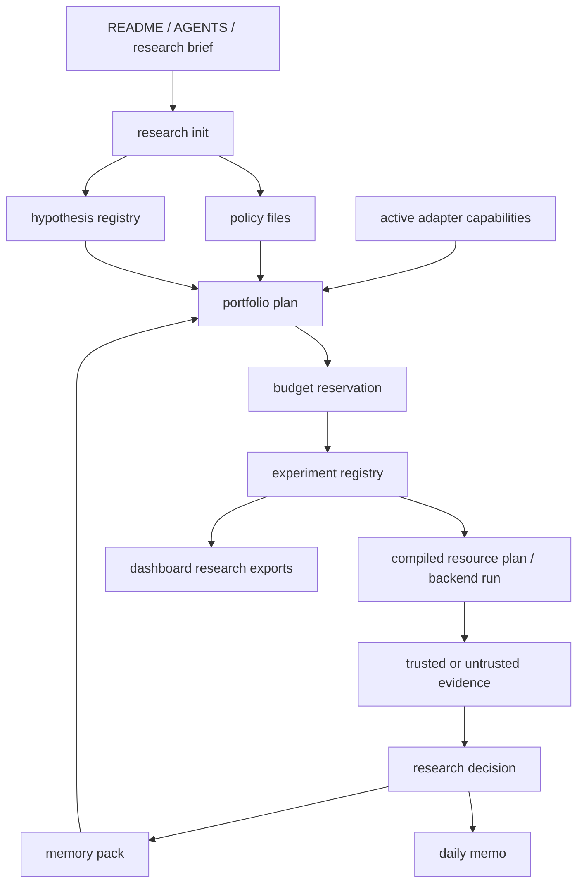
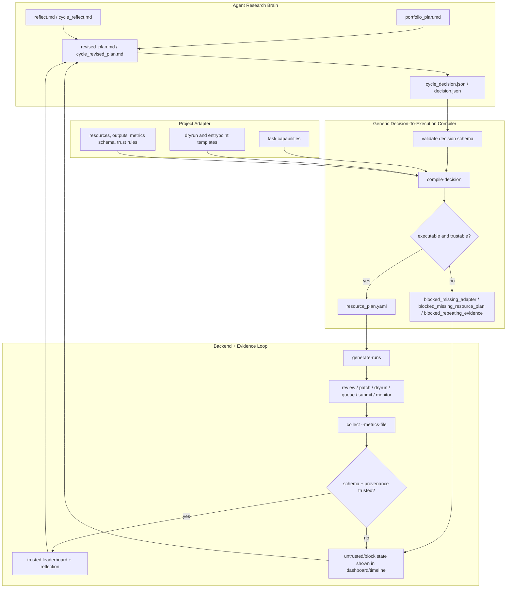

<h1 align="center">VibeResearch</h1>
<h3 align="center">Repo-local research orchestration for Codex, Slurm, idea pools, dashboards, and meeting reports</h3>

<p align="center">
  <strong>A local-first control layer that keeps long-running research state inside each target repository's <code>.vibe/</code> directory.</strong>
</p>

<p align="center">
  <a href="README.md">English</a> |
  <a href="docs/README_CN.md">中文</a>
</p>

<p align="center">
  <a href="#quick-start"></a>
  <a href="#dashboard-and-reports"></a>
  <a href="#slurm-and-scheduler"></a>
</p>

<p align="center">
  
  
  
  
</p>

---

## What It Is

VibeResearch is a repo-specific sustained research orchestration framework. It
adds a `.vibe/` control layer to a target repository and keeps authoritative
research state there: project brief, config, cycles, runs, scheduler queues,
paper DB, wiki, idea pool, deep research requests, dashboards, reports, and
artifacts.

Codex can help write plans, reviews, patches, reflections, revised plans, wiki
updates, and deep research requests. Deterministic Python code owns dry-runs,
queueing, Slurm submission, monitoring, collection, provenance, dashboards, and
meeting exports.

## Quick Start

Install the framework CLI from this repository:

```bash
cd /path/to/VibeResearch
python -m pip install -e .
```

Initialize a target research repo:

```bash
cd /path/to/your/research-repo
vibe init \
  --goal "Improve robust validation performance under a fixed protocol" \
  --background "Project context, datasets, metrics, compute constraints, and current baseline"
```

Check state and the next recommended action:

```bash
vibe config validate
vibe status
vibe next
```

If you want no generated files in the target repo root:

```bash
vibe init --no-root-portal --goal "..." --background "..."
```

## Codex-Assisted Onboarding

If you want Codex to install and bootstrap VibeResearch for a downstream repo
instead of following the README manually, give Codex the prompt in
[`docs/bootstrap/CODEX_ONBOARDING_PROMPT_CN.md`](docs/bootstrap/CODEX_ONBOARDING_PROMPT_CN.md).
That prompt tells Codex to clone from GitHub, install the framework, ask for the
required project goal/background, run bootstrap, summarize readiness blockers,
write your answers into the target repo's `.vibe/` files, and resume until the
safe minimum capability is ready or explicitly blocked.

## Start A Local Mock Cycle

v0.7.1 intentionally blocks placeholder experiments until adapter readiness is
met. To run the packaged local smoke workflow, use:

```bash
vibe dogfood
```

For tests and local development, the bundled generic `toy` adapter can compile a
structured decision into a real resource plan:

```yaml
# .vibe/config.local.yaml
adapter:
  kind: toy
```

```bash
vibe idea "try a cheap baseline diagnostic before expensive training"
vibe ideas triage
vibe plan-cycle --offline
vibe review-cycle c001 --offline
vibe decision write c001 --type launch_gpu_gate --action "run toy adapter task" --direction d001_toy
vibe compile-decision c001
vibe generate-runs c001 --count 1
vibe review r001_toy_audit --offline
vibe patch r001_toy_audit --offline
vibe dryrun r001_toy_audit
vibe queue r001_toy_audit
vibe submit-queue --dry
vibe monitor
vibe collect r001_toy_audit --metric 0.1
vibe reflect r001_toy_audit --offline
vibe decision write r001_toy_audit --type collect_more_metrics --action "collect schema-valid metrics"
vibe revise-plan r001_toy_audit --offline
vibe reflect-cycle c001 --offline
vibe decision write c001 --type launch_gpu_gate --action "compile next toy adapter task" --direction d001_toy
vibe revise-cycle c001 --offline
```

## What Gets Created

```text
.vibe/
  project/brief.md
  config.yaml
  config.schema.json
  config.local.yaml
  adapter.yaml
  adapter_questions.yaml
  research_brief.md
  discovery_report.md
  script_bootstrap_plan.md
  scripts/
  contract_tests/
  run_contracts/
  adapter_history.jsonl
  policies/
  state/
  cycles/
  runs/
  scheduler/
  ideas/
  research/
    events.jsonl
    hypotheses.json
    experiments.json
    evidence.json
    decisions.jsonl
    budget_ledger.jsonl
  memos/
  dashboard/
  site/
  reports/
  portal/
```

Root files such as `RUN.md`, `VIBE_STATUS.md`, `VIBE_TODO.md`,
`VIBE_TIMELINE.md`, and `VIBE_LEADERBOARD.md` are generated mirrors only. The
source of truth stays under `.vibe/`. You can rebuild mirrors at any time:

```bash
vibe portal build
```

VibeResearch does not modify root `AGENTS.md` unless explicitly requested:

```bash
vibe init --install-agents-snippet --goal "..." --background "..."
```

## Core Workflow

1. Capture context: `vibe init --goal ... --background ...`
2. Bring the adapter to readiness: `vibe adapter doctor`
3. Capture ideas: `vibe idea "..."`, `vibe ideas triage`
4. Plan a portfolio: `vibe plan-cycle`
5. Review the portfolio: `vibe review-cycle c001`
6. Write or obtain a structured cycle decision: `.vibe/cycles/c001/cycle_decision.json`
7. Compile it through a project adapter: `vibe compile-decision c001`
8. Generate runs only from the compiled plan: `vibe generate-runs c001`
9. Review and patch each run: `vibe review`, `vibe patch`
10. Dry-run and queue: `vibe dryrun`, `vibe queue`
11. Submit and monitor: `vibe submit-queue`, `vibe monitor`
12. Collect schema-valid metrics: `vibe collect --metrics-file ...`
13. Reflect and revise: `vibe reflect`, `vibe revise-plan`, `vibe revise-cycle`
14. Build dashboard and meeting report: `vibe dashboard build`, `vibe export-meeting`

## Adapter Onboarding

v0.7.1 turns the project adapter into an explicit capability contract. The
adapter says what VibeResearch is allowed to do; execution scripts are thin
repo-owned wrappers that implement those capabilities. VibeResearch does not
store project-specific training, evaluation, or submission logic in the main
framework.

Normal `vibe init` creates a partial adapter and script bootstrap surface:

```bash
vibe adapter discover
vibe adapter draft
vibe adapter ask
vibe script bootstrap --plan
vibe adapter lint
vibe adapter doctor
```

Only `active` capabilities can be selected by the planner. `candidate`, `draft`,
`blocked_missing_script`, `blocked_missing_metrics_schema`, and
`blocked_missing_user_answer` capabilities are visible in the dashboard but are
not executable. A capability becomes active only after:

```bash
vibe adapter contract-test metrics_export
vibe adapter activate metrics_export --confirm "reviewed by project owner"
```

Generated wrappers in `.vibe/scripts/` are draft/untrusted. They include
provenance headers and must be replaced or reviewed by the downstream repo
before activation. Establish evaluation or metrics-export capabilities before
training automation; GPU and long-run capabilities remain blocked unless the
adapter resource policy explicitly allows them.

The static dashboard and Markdown mirrors show adapter maturity, active/draft
and blocked capabilities, missing scripts, missing metrics schemas, unanswered
questions, lint status, contract-test status, adapter revision, and adapter
metadata on compiled runs.

Migrating a v0.7.0 project:

```bash
vibe adapter init
vibe adapter discover
vibe adapter draft
vibe adapter doctor
```

Move any real `.vibe/adapter.yaml` `task:` command into a capability with
`dryrun`, `entrypoint`, `metrics_schema`, `artifact_rules`, `resources`,
`trust_checks`, and `contract_tests`. Placeholder commands remain blocked and
old trusted/untrusted leaderboard provenance is preserved.

## Bounded Autonomous Research Manager

v0.8.0 adds the long-running research layer above the v0.7.1 adapter gate. The
agent can propose hypotheses, experiment designs, analysis decisions, and
stopping or promotion judgments, but the framework owns memory, policy,
evidence validity, budget reservation, traceability, and blocking unsafe
automation.



Important commands:

```bash
vibe research init --goal "..." --background "..." --memo-language zh-CN
vibe hypothesis create "try a calibrated evaluator" --stage analysis
vibe experiment create hyp_001 --design "calibration smoke" --stage analysis --capability metrics_export
vibe experiment analyze exp_001 --trusted --schema-valid --summary "primary improved without guardrail regression"
vibe memory build
vibe portfolio plan
vibe portfolio schedule
vibe budget status
vibe memo daily --language zh-CN
vibe dashboard export-research
```

Project-specific code still belongs to the downstream repo: adapter
capabilities and execution scripts live in `.vibe/adapter.yaml` and
`.vibe/scripts/`. Generic research policy lives in `.vibe/policies/`, registry
state in `.vibe/research/`, daily memos in `.vibe/memos/`, and future
visualization data in `.vibe/dashboard/`.

Promotion requires trusted, schema-valid evidence and no protected metric
regression unless policy allows an explicit override. Stopping requires trusted
negative evidence or an explicit user decision. The portfolio scheduler blocks
missing capabilities, missing scripts, missing metrics schemas, unknown cost
when policy says to block, over-budget work, autonomy-level violations, and
same-hypothesis same-stage duplicate experiments without a new variable or
failure analysis.

## Bootstrap Orchestrator And Dogfood

v0.8.1 turns adapter onboarding and the research manager into a resumable
project deployment workflow. It does not hardcode downstream projects. It
creates drafts, validates them, activates only contract-tested capabilities,
and writes readiness reports that explain what can run, what is blocked, and
the smallest next action.

```bash
vibe bootstrap init --goal "..." --background "..."
vibe bootstrap run
vibe bootstrap status
vibe bootstrap resume
vibe bootstrap doctor
```

Bootstrap writes `.vibe/bootstrap/state.json`,
`.vibe/bootstrap/sessions/<session>.json`,
`.vibe/bootstrap/readiness_report.md`, and
`.vibe/bootstrap/readiness.json`. Phases are `intake`, `discovery`, `draft`,
`questions`, `validation`, `activation`, and `report`; each phase records
inputs, hashes, outputs, warnings, blockers, retries, next actions, generated
artifacts, and provenance. Resume preserves user-edited adapter, script,
question, and policy files and emits merge warnings instead of silently
overwriting them.

Local dogfood sandboxes are ignored by git:

```bash
vibe bootstrap dogfood --profile 0.8.1-happy-path
vibe bootstrap dogfood --profile 0.8.1-missing-metrics
vibe bootstrap dogfood --profile 0.8.1-policy-conflict
vibe bootstrap dogfood --profile 0.8.1-placeholder-script
```

External dogfood should inspect or bootstrap the downstream repo without
copying project-specific logic into VibeResearch:

```bash
vibe bootstrap dogfood --external-repo /path/to/repo --brief-file /path/to/problem.md --dry-run --output-report /tmp/dogfood.json
vibe bootstrap archive --source /path/to/repo --note "legacy automation before fresh bootstrap"
vibe bootstrap import-legacy .vibe/archives/<id>/manifest.json
```

Legacy results import as `imported_unverified` historical context unless the
current adapter revision, capability id, metrics schema, artifact rules, and
provenance validate them. Policy completeness blocks unsafe execution: missing
budget blocks queue submission, missing autonomy blocks automatic execution,
missing stage gates block promotion, and missing protected metrics blocks
automatic higher-stage promotion.

## Decision-To-Execution Safety

v0.7.0 adds a structured three-layer bridge between plan text and executable
work:



```text
cycle_revised_plan.md / revised_plan.md
  -> cycle_decision.json / decision.json
  -> project adapter
  -> compiled resource_plan.yaml
  -> run manifests
  -> trusted metrics only after schema + provenance checks
```

By default, the adapter is `config` and reads `.vibe/adapter.yaml`. It blocks
with adapter readiness and missing-capability statuses instead of generating
fake CPU/GPU placeholder work. Use `adapter.kind: toy` only for local smoke
tests. Useful commands include:

```bash
vibe validate-decision c001
vibe decision show c001
vibe decision write c001 --type launch_gpu_gate --action "run configured adapter task"
vibe decision write-block c001 --reason "adapter missing"
vibe compile-decision c001
vibe validate-resource-plan c001
```

Minimal active capability shape for `adapter.kind: config`:

```yaml
capabilities:
  - id: metrics_export
    version: v1
    status: active
    task_type: metrics_export
    supported_decisions: [collect_more_metrics]
    dryrun:
      command: python .vibe/scripts/metrics_export.py --dryrun
    entrypoint:
      type: local
      command: python .vibe/scripts/metrics_export.py --smoke
    outputs:
      expected_output_path: .vibe/bootstrap_metrics/metrics_export.json
      metrics_file_path: .vibe/bootstrap_metrics/metrics_export.json
    metrics_schema:
      required: [primary]
      types:
        primary: number
      version: v1
    artifact_rules:
      expected_outputs: [.vibe/bootstrap_metrics/metrics_export.json]
      version: v1
    resources:
      automatic_submission_allowed: false
      default: {gpu: 0, cpus: 1, mem_gb: 1, time: "00:05:00"}
    trust_checks: [schema_valid_metrics, expected_output_exists]
    contract_tests: [metrics_export]
    activation:
      contract_status: passed
```

Repeated evidence-only loops and missing/default metrics are marked untrusted or
blocked; they no longer update best/best-by-direction leaderboard state.

## Idea Pool

The raw inbox captures user prompts. The maintained idea pool turns them into
workable research items with stable IDs such as `idea_001`.

```bash
vibe idea "compare two route-level approaches"
vibe ideas list
vibe ideas triage
vibe ideas promote idea_001
vibe ideas reject idea_001 --reason "out of scope"
vibe ideas archive idea_001
vibe ideas clean
```

Idea files live under `.vibe/ideas/`:

```text
registry.jsonl
pool.md
active.md
deep_research_candidates.md
backlog.md
rejected.md
archive.md
```

## Deep Research From Ideas

Marking an idea as `needs_deep_research` does not automatically create a deep
research request. A user or operator must explicitly trigger it:

```bash
vibe deep-request-from-idea idea_001
```

Put the returned report in:

```text
.vibe/research/raw/deep_reports/<request_id>_result.md
.vibe/research/raw/deep_reports/<request_id>_result.pdf
```

Then ingest it:

```bash
vibe ingest-deep-research dr001_idea_001 --kind science
vibe ingest-deep-research dr001_idea_001 --kind workflow
vibe ingest-deep-research dr001_idea_001 --kind repo
vibe ingest-deep-research dr001_idea_001 --kind benchmark
```

Markdown and PDF are supported. PDF extraction uses PyMuPDF when available; no
OCR is attempted.

## Slurm And Scheduler

The scheduler is deterministic and budget-aware. It will not submit runs that
have not passed dry-run, have invalid manifests, are blocked by portfolio/run
review, violate dependencies, or exceed configured budgets.

Detect local capabilities:

```bash
vibe config detect
```

Edit these files for cluster-specific settings:

```text
.vibe/config.yaml
.vibe/config.local.yaml
.vibe/scheduler/budget.yaml
```

Submit with Slurm:

```bash
vibe submit-queue --backend slurm
vibe monitor --loop --auto-next
```

Local dry mode is useful for development:

```bash
vibe submit-queue --dry
```

## Dashboard And Reports

Build a static read-only dashboard:

```bash
vibe dashboard build
```

Output:

```text
.vibe/site/index.html
```

Serve locally:

```bash
vibe dashboard serve --host 127.0.0.1 --port 8765
```

Export a meeting story pack:

```bash
vibe export-meeting
vibe export-meeting --date 20260529
```

Output:

```text
.vibe/reports/meeting/YYYYMMDD/
  story.md
  timeline.md
  leaderboard.md
  key_runs.md
  idea_pool.md
  deep_research_status.md
  paper_summary.md
  evidence_table.csv
  slides_outline.md
  figures/
```

Generate final development reports and portal docs:

```bash
vibe finalize-reports
```

## Useful Commands

```bash
vibe status
vibe next
vibe config show
vibe config validate
vibe audit current
vibe validate-hard-rules
vibe scheduler-status
vibe leaderboard
vibe timeline
```

## Design Principles

- `.vibe/` is the authoritative state root.
- Root files are generated mirrors, never unique state.
- Codex writes bounded artifacts; deterministic code owns execution.
- Dashboard defaults to read-only.
- Long-running monitoring makes no LLM calls.
- Real Slurm/Codex/network behavior should be validated in the deployment environment.

## Current Status

The local/offline acceptance path is implemented and covered by tests:

```bash
python -m pytest -q
```

The test suite uses fake/offline Codex and dry Slurm paths, so it does not
require network, Codex auth, GPU, or a cluster.
