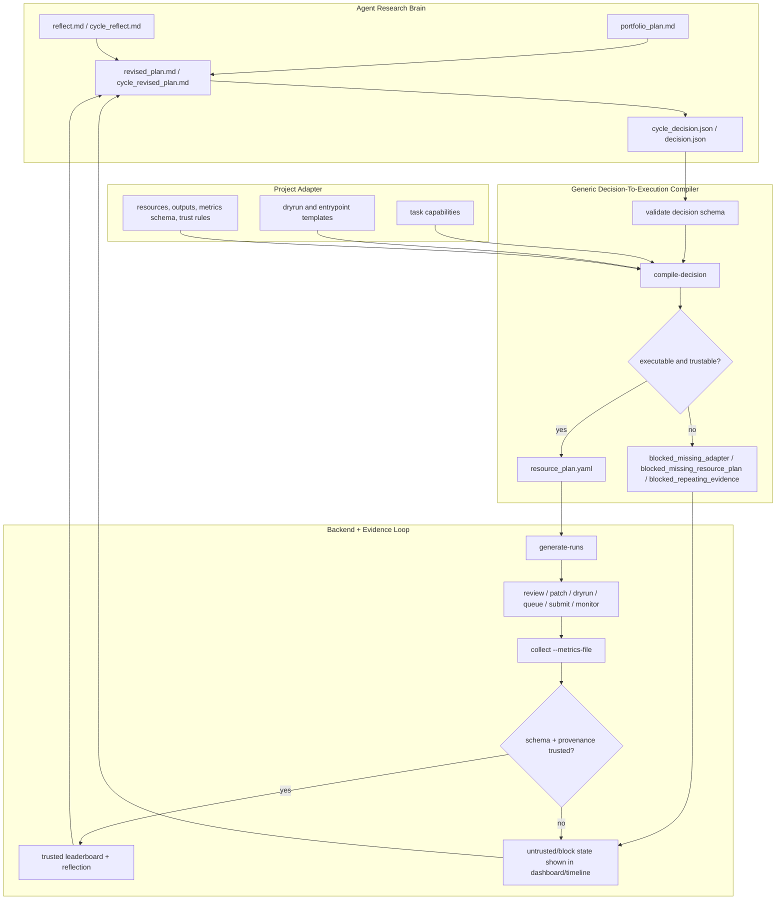

<h1 align="center">VibeResearch</h1>
<h3 align="center">Repo-local research orchestration for Codex, Slurm, idea pools, dashboards, and meeting reports</h3>

<p align="center">
  <strong>A local-first control layer that keeps long-running research state inside each target repository's <code>.vibe/</code> directory.</strong>
</p>

<p align="center">
  <a href="README.md">English</a> |
  <a href="docs/README_CN.md">中文</a>
</p>

<p align="center">
  <a href="#quick-start"></a>
  <a href="#dashboard-and-reports"></a>
  <a href="#slurm-and-scheduler"></a>
</p>

<p align="center">
  
  
  
  
</p>

---

## What It Is

VibeResearch is a repo-specific sustained research orchestration framework. It
adds a `.vibe/` control layer to a target repository and keeps authoritative
research state there: project brief, config, cycles, runs, scheduler queues,
paper DB, wiki, idea pool, deep research requests, dashboards, reports, and
artifacts.

Codex can help write plans, reviews, patches, reflections, revised plans, wiki
updates, and deep research requests. Deterministic Python code owns dry-runs,
queueing, Slurm submission, monitoring, collection, provenance, dashboards, and
meeting exports.

## Quick Start

Install the framework CLI from this repository:

```bash
cd /path/to/VibeResearch
python -m pip install -e .
```

Initialize a target research repo:

```bash
cd /path/to/your/research-repo
vibe init \
  --goal "Improve robust validation performance under a fixed protocol" \
  --background "Project context, datasets, metrics, compute constraints, and current baseline"
```

Check state and the next recommended action:

```bash
vibe config validate
vibe status
vibe next
```

If you want no generated files in the target repo root:

```bash
vibe init --no-root-portal --goal "..." --background "..."
```

## Start A Local Mock Cycle

v0.7.0 intentionally blocks placeholder experiments. To run a local mock cycle,
use the bundled `toy` adapter so a structured decision can compile into a real
resource plan:

```yaml
# .vibe/config.local.yaml
adapter:
  kind: toy
```

```bash
vibe idea "try a cheap baseline diagnostic before expensive training"
vibe ideas triage
vibe plan-cycle --offline
vibe review-cycle c001 --offline
vibe decision write c001 --type launch_gpu_gate --action "run toy adapter task" --direction d001_toy
vibe compile-decision c001
vibe generate-runs c001 --count 1
vibe review r001_toy_audit --offline
vibe patch r001_toy_audit --offline
vibe dryrun r001_toy_audit
vibe queue r001_toy_audit
vibe submit-queue --dry
vibe monitor
vibe collect r001_toy_audit --metric 0.1
vibe reflect r001_toy_audit --offline
vibe decision write r001_toy_audit --type collect_more_metrics --action "collect schema-valid metrics"
vibe revise-plan r001_toy_audit --offline
vibe reflect-cycle c001 --offline
vibe decision write c001 --type launch_gpu_gate --action "compile next toy adapter task" --direction d001_toy
vibe revise-cycle c001 --offline
```

Or run the packaged smoke workflow:

```bash
vibe dogfood
```

## What Gets Created

```text
.vibe/
  project/brief.md
  config.yaml
  config.schema.json
  config.local.yaml
  state/
  cycles/
  runs/
  scheduler/
  ideas/
  research/
  dashboard/
  site/
  reports/
  portal/
```

Root files such as `RUN.md`, `VIBE_STATUS.md`, `VIBE_TODO.md`,
`VIBE_TIMELINE.md`, and `VIBE_LEADERBOARD.md` are generated mirrors only. The
source of truth stays under `.vibe/`. You can rebuild mirrors at any time:

```bash
vibe portal build
```

VibeResearch does not modify root `AGENTS.md` unless explicitly requested:

```bash
vibe init --install-agents-snippet --goal "..." --background "..."
```

## Core Workflow

1. Capture context: `vibe init --goal ... --background ...`
2. Capture ideas: `vibe idea "..."`, `vibe ideas triage`
3. Plan a portfolio: `vibe plan-cycle`
4. Review the portfolio: `vibe review-cycle c001`
5. Write or obtain a structured cycle decision: `.vibe/cycles/c001/cycle_decision.json`
6. Compile it through a project adapter: `vibe compile-decision c001`
7. Generate runs only from the compiled plan: `vibe generate-runs c001`
8. Review and patch each run: `vibe review`, `vibe patch`
9. Dry-run and queue: `vibe dryrun`, `vibe queue`
10. Submit and monitor: `vibe submit-queue`, `vibe monitor`
11. Collect schema-valid metrics: `vibe collect --metrics-file ...`
12. Reflect and revise: `vibe reflect`, `vibe revise-plan`, `vibe revise-cycle`
13. Build dashboard and meeting report: `vibe dashboard build`, `vibe export-meeting`

## Decision-To-Execution Safety

v0.7.0 adds a structured three-layer bridge between plan text and executable
work:



```text
cycle_revised_plan.md / revised_plan.md
  -> cycle_decision.json / decision.json
  -> project adapter
  -> compiled resource_plan.yaml
  -> run manifests
  -> trusted metrics only after schema + provenance checks
```

By default, the adapter is `noop`; it blocks with
`blocked_missing_adapter` instead of generating fake CPU/GPU placeholder work.
Use `adapter.kind: config` with `.vibe/adapter.yaml` for a real downstream repo,
or `adapter.kind: toy` for local smoke tests. The new commands are:

```bash
vibe validate-decision c001
vibe decision show c001
vibe decision write c001 --type launch_gpu_gate --action "run configured adapter task"
vibe decision write-block c001 --reason "adapter missing"
vibe compile-decision c001
vibe validate-resource-plan c001
```

Minimal `.vibe/adapter.yaml` shape for `adapter.kind: config`:

```yaml
task:
  key: gpu-gate
  direction_id: d001_candidate
  hypothesis: Run the project-specific GPU gate.
  dryrun_command: python scripts/smoke.py
  entrypoint_command: python scripts/train.py --config configs/gate.yaml
  expected_output_path: outputs/gate/metrics.json
  metrics_file_path: outputs/gate/metrics.json
  metrics_schema:
    primary: number
  resources:
    gpu: 1
    cpus: 8
    mem_gb: 32
    time: "04:00:00"
```

Repeated evidence-only loops and missing/default metrics are marked untrusted or
blocked; they no longer update best/best-by-direction leaderboard state.

## Idea Pool

The raw inbox captures user prompts. The maintained idea pool turns them into
workable research items with stable IDs such as `idea_001`.

```bash
vibe idea "compare two route-level approaches"
vibe ideas list
vibe ideas triage
vibe ideas promote idea_001
vibe ideas reject idea_001 --reason "out of scope"
vibe ideas archive idea_001
vibe ideas clean
```

Idea files live under `.vibe/ideas/`:

```text
registry.jsonl
pool.md
active.md
deep_research_candidates.md
backlog.md
rejected.md
archive.md
```

## Deep Research From Ideas

Marking an idea as `needs_deep_research` does not automatically create a deep
research request. A user or operator must explicitly trigger it:

```bash
vibe deep-request-from-idea idea_001
```

Put the returned report in:

```text
.vibe/research/raw/deep_reports/<request_id>_result.md
.vibe/research/raw/deep_reports/<request_id>_result.pdf
```

Then ingest it:

```bash
vibe ingest-deep-research dr001_idea_001 --kind science
vibe ingest-deep-research dr001_idea_001 --kind workflow
vibe ingest-deep-research dr001_idea_001 --kind repo
vibe ingest-deep-research dr001_idea_001 --kind benchmark
```

Markdown and PDF are supported. PDF extraction uses PyMuPDF when available; no
OCR is attempted.

## Slurm And Scheduler

The scheduler is deterministic and budget-aware. It will not submit runs that
have not passed dry-run, have invalid manifests, are blocked by portfolio/run
review, violate dependencies, or exceed configured budgets.

Detect local capabilities:

```bash
vibe config detect
```

Edit these files for cluster-specific settings:

```text
.vibe/config.yaml
.vibe/config.local.yaml
.vibe/scheduler/budget.yaml
```

Submit with Slurm:

```bash
vibe submit-queue --backend slurm
vibe monitor --loop --auto-next
```

Local dry mode is useful for development:

```bash
vibe submit-queue --dry
```

## Dashboard And Reports

Build a static read-only dashboard:

```bash
vibe dashboard build
```

Output:

```text
.vibe/site/index.html
```

Serve locally:

```bash
vibe dashboard serve --host 127.0.0.1 --port 8765
```

Export a meeting story pack:

```bash
vibe export-meeting
vibe export-meeting --date 20260529
```

Output:

```text
.vibe/reports/meeting/YYYYMMDD/
  story.md
  timeline.md
  leaderboard.md
  key_runs.md
  idea_pool.md
  deep_research_status.md
  paper_summary.md
  evidence_table.csv
  slides_outline.md
  figures/
```

Generate final development reports and portal docs:

```bash
vibe finalize-reports
```

## Useful Commands

```bash
vibe status
vibe next
vibe config show
vibe config validate
vibe audit current
vibe validate-hard-rules
vibe scheduler-status
vibe leaderboard
vibe timeline
```

## Design Principles

- `.vibe/` is the authoritative state root.
- Root files are generated mirrors, never unique state.
- Codex writes bounded artifacts; deterministic code owns execution.
- Dashboard defaults to read-only.
- Long-running monitoring makes no LLM calls.
- Real Slurm/Codex/network behavior should be validated in the deployment environment.

## Current Status

The local/offline acceptance path is implemented and covered by tests:

```bash
python -m pytest -q
```

The test suite uses fake/offline Codex and dry Slurm paths, so it does not
require network, Codex auth, GPU, or a cluster.
