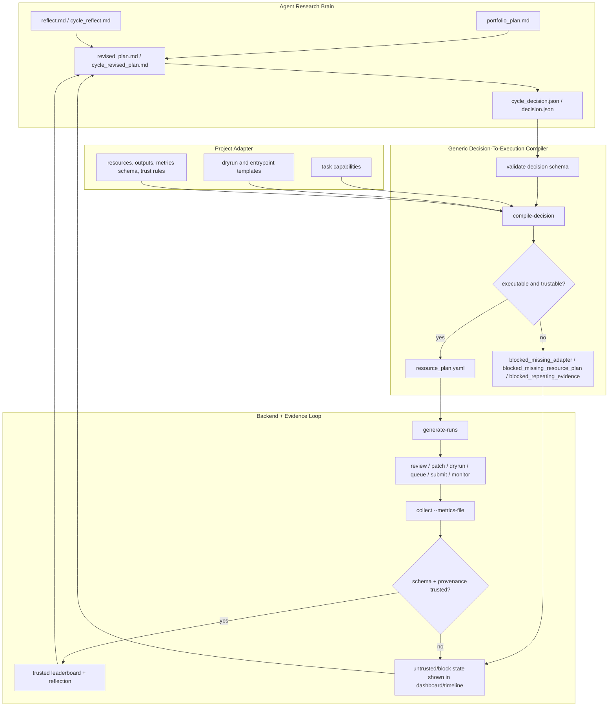

<h1 align="center">VibeResearch</h1>
<h3 align="center">面向 Codex、Slurm、Idea Pool、Dashboard 和组会汇报的 repo-local 研究编排框架</h3>

<p align="center">
  <strong>把长期研究状态集中保存在目标仓库的 <code>.vibe/</code> 目录中，让规划、执行、监控、复盘和汇报形成闭环。</strong>
</p>

<p align="center">
  <a href="../README.md">English</a> |
  <a href="README_CN.md">中文</a>
</p>

<p align="center">
  <a href="#快速开始"></a>
  <a href="#dashboard-和报告"></a>
  <a href="#slurm-和-scheduler"></a>
</p>

<p align="center">
  
  
  
  
</p>

---

## 这是什么

VibeResearch 是一个 repo-specific 的持续研究编排框架。它会在目标仓库中创建 `.vibe/` 控制层，并把权威研究状态集中保存在这里：项目 brief、配置、cycle、run、scheduler 队列、paper DB、wiki、idea pool、deep research request、dashboard、report 和 artifact。

Codex 可以负责编写 plan、review、patch、reflection、revised plan、wiki update 和 deep research request；确定性的 Python 代码负责 dry-run、排队、Slurm 提交、监控、结果收集、provenance、dashboard 和组会材料导出。

## 快速开始

先从本仓库安装 CLI：

```bash
cd /path/to/VibeResearch
python -m pip install -e .
```

然后进入你的目标研究仓库：

```bash
cd /path/to/your/research-repo
vibe init \
  --goal "在固定协议下提升 robust validation 表现" \
  --background "项目背景、数据、指标、算力约束和当前 baseline"
```

检查状态和下一步：

```bash
vibe config validate
vibe status
vibe next
```

如果不希望目标仓库根目录生成 `RUN.md` / `VIBE_*.md` 镜像文件：

```bash
vibe init --no-root-portal --goal "..." --background "..."
```

## 跑一个本地 Mock Cycle

v0.7.1 默认会在 adapter readiness 未满足时阻止 placeholder 实验。要跑内置本地
smoke workflow，可以直接执行：

```bash
vibe dogfood
```

测试和本地开发也可以使用内置 generic `toy` adapter，让结构化 decision 编译成真实
resource plan：

```yaml
# .vibe/config.local.yaml
adapter:
  kind: toy
```

```bash
vibe idea "先跑一个便宜的 baseline diagnostic，再考虑昂贵训练"
vibe ideas triage
vibe plan-cycle --offline
vibe review-cycle c001 --offline
vibe decision write c001 --type launch_gpu_gate --action "run toy adapter task" --direction d001_toy
vibe compile-decision c001
vibe generate-runs c001 --count 1
vibe review r001_toy_audit --offline
vibe patch r001_toy_audit --offline
vibe dryrun r001_toy_audit
vibe queue r001_toy_audit
vibe submit-queue --dry
vibe monitor
vibe collect r001_toy_audit --metric 0.1
vibe reflect r001_toy_audit --offline
vibe decision write r001_toy_audit --type collect_more_metrics --action "collect schema-valid metrics"
vibe revise-plan r001_toy_audit --offline
vibe reflect-cycle c001 --offline
vibe decision write c001 --type launch_gpu_gate --action "compile next toy adapter task" --direction d001_toy
vibe revise-cycle c001 --offline
```

## 会创建哪些文件

```text
.vibe/
  project/brief.md
  config.yaml
  config.schema.json
  config.local.yaml
  adapter.yaml
  adapter_questions.yaml
  research_brief.md
  discovery_report.md
  script_bootstrap_plan.md
  scripts/
  contract_tests/
  run_contracts/
  adapter_history.jsonl
  state/
  cycles/
  runs/
  scheduler/
  ideas/
  research/
  dashboard/
  site/
  reports/
  portal/
```

根目录中的 `RUN.md`、`VIBE_STATUS.md`、`VIBE_TODO.md`、`VIBE_TIMELINE.md`、`VIBE_LEADERBOARD.md` 只是生成镜像，不是权威状态。权威状态始终在 `.vibe/` 下。删除根目录镜像后可以随时重建：

```bash
vibe portal build
```

默认不会修改根目录已有的 `AGENTS.md`。只有显式传参时才会安装 snippet：

```bash
vibe init --install-agents-snippet --goal "..." --background "..."
```

## 核心工作流

1. 初始化项目上下文：`vibe init --goal ... --background ...`
2. 先完成 adapter readiness：`vibe adapter doctor`
3. 捕获想法：`vibe idea "..."`，`vibe ideas triage`
4. 制定 portfolio：`vibe plan-cycle`
5. 审核 portfolio：`vibe review-cycle c001`
6. 写入或获得结构化 cycle decision：`.vibe/cycles/c001/cycle_decision.json`
7. 通过项目 adapter 编译：`vibe compile-decision c001`
8. 只从已编译 resource plan 生成 runs：`vibe generate-runs c001`
9. 审核并 patch 每个 run：`vibe review`，`vibe patch`
10. dry-run 并入队：`vibe dryrun`，`vibe queue`
11. 提交并监控：`vibe submit-queue`，`vibe monitor`
12. 收集 schema-valid 指标：`vibe collect --metrics-file ...`
13. 复盘并修订计划：`vibe reflect`，`vibe revise-plan`，`vibe revise-cycle`
14. 构建 dashboard 和组会材料：`vibe dashboard build`，`vibe export-meeting`

## Adapter Onboarding / 接入流程

v0.7.1 把 project adapter 变成明确的 capability contract。adapter 描述
VibeResearch 允许做什么；execution scripts 是下游 repo 自己维护的薄 wrapper，
负责真正调用项目的 train/eval/infer/submission 逻辑。VibeResearch 主框架不保存任何
项目特定训练、评估或提交逻辑。

普通 `vibe init` 会创建 partial adapter 和脚本 bootstrap surface：

```bash
vibe adapter discover
vibe adapter draft
vibe adapter ask
vibe script bootstrap --plan
vibe adapter lint
vibe adapter doctor
```

planner 只会选择 `active` capability。`candidate`、`draft`、
`blocked_missing_script`、`blocked_missing_metrics_schema` 和
`blocked_missing_user_answer` 只会显示在 dashboard 中，不会被自动执行。
capability 只有通过 contract test 后才能激活：

```bash
vibe adapter contract-test metrics_export
vibe adapter activate metrics_export --confirm "reviewed by project owner"
```

`.vibe/scripts/` 里生成的 wrapper 默认是 draft/untrusted，带 provenance header，
需要下游 repo 审查或替换后才能激活。应先建立 evaluation 或 metrics-export 能力，
再建立 training automation；GPU 和 long-run capability 必须有明确 resource policy。

dashboard 和 Markdown 镜像会显示 adapter maturity、active/draft/blocked capability、
缺失脚本、缺失 metrics schema、未回答问题、lint 状态、contract-test 状态、adapter
revision，以及 run metadata 中使用的 adapter/capability 信息。

从 v0.7.0 迁移时：

```bash
vibe adapter init
vibe adapter discover
vibe adapter draft
vibe adapter doctor
```

把已有真实 `task:` 命令迁移为包含 `dryrun`、`entrypoint`、`metrics_schema`、
`artifact_rules`、`resources`、`trust_checks` 和 `contract_tests` 的 capability。
placeholder command 会继续被阻塞，旧 leaderboard 的 trusted/untrusted provenance 不会被静默覆盖。

## Decision-To-Execution Safety

v0.7.0 增加了从文字计划到可执行实验的三层结构化桥接：



```text
cycle_revised_plan.md / revised_plan.md
  -> cycle_decision.json / decision.json
  -> project adapter
  -> compiled resource_plan.yaml
  -> run manifests
  -> 只有通过 schema + provenance 检查的 trusted metrics 才更新 leaderboard best
```

默认 adapter 是 `config`，并读取 `.vibe/adapter.yaml`。如果 readiness 或 active
capability 不足，它会以明确的 adapter blocker 停止，而不是继续生成假的 CPU/GPU
placeholder 工作。本地 smoke test 可以使用 `adapter.kind: toy`。

```bash
vibe validate-decision c001
vibe decision show c001
vibe decision write c001 --type launch_gpu_gate --action "run configured adapter task"
vibe decision write-block c001 --reason "adapter missing"
vibe compile-decision c001
vibe validate-resource-plan c001
```

`adapter.kind: config` 对应的最小 active capability 示例：

```yaml
capabilities:
  - id: metrics_export
    version: v1
    status: active
    task_type: metrics_export
    supported_decisions: [collect_more_metrics]
    dryrun:
      command: python .vibe/scripts/metrics_export.py --dryrun
    entrypoint:
      type: local
      command: python .vibe/scripts/metrics_export.py --smoke
    outputs:
      expected_output_path: .vibe/bootstrap_metrics/metrics_export.json
      metrics_file_path: .vibe/bootstrap_metrics/metrics_export.json
    metrics_schema:
      required: [primary]
      types:
        primary: number
      version: v1
    artifact_rules:
      expected_outputs: [.vibe/bootstrap_metrics/metrics_export.json]
      version: v1
    resources:
      automatic_submission_allowed: false
      default: {gpu: 0, cpus: 1, mem_gb: 1, time: "00:05:00"}
    trust_checks: [schema_valid_metrics, expected_output_exists]
    contract_tests: [metrics_export]
    activation:
      contract_status: passed
```

重复 evidence-only 循环、缺失指标和默认 0.0 指标会被标记为 untrusted 或 blocked，不再更新
best / best-by-direction leaderboard 状态。

## Idea Pool / 想法池

raw inbox 负责保存用户原始输入；idea pool 负责维护可工作的研究想法，并分配稳定 ID，例如 `idea_001`。

```bash
vibe idea "比较两条路线级方法"
vibe ideas list
vibe ideas triage
vibe ideas promote idea_001
vibe ideas reject idea_001 --reason "暂时超出范围"
vibe ideas archive idea_001
vibe ideas clean
```

相关文件位于 `.vibe/ideas/`：

```text
registry.jsonl
pool.md
active.md
deep_research_candidates.md
backlog.md
rejected.md
archive.md
```

## 从 Idea 生成 Deep Research

把 idea 标记为 `needs_deep_research` 不会自动生成 deep research request。需要用户或 operator 显式触发：

```bash
vibe deep-request-from-idea idea_001
```

把返回的 deep research 报告放到：

```text
.vibe/research/raw/deep_reports/<request_id>_result.md
.vibe/research/raw/deep_reports/<request_id>_result.pdf
```

然后 ingest：

```bash
vibe ingest-deep-research dr001_idea_001 --kind science
vibe ingest-deep-research dr001_idea_001 --kind workflow
vibe ingest-deep-research dr001_idea_001 --kind repo
vibe ingest-deep-research dr001_idea_001 --kind benchmark
```

支持 Markdown 和 PDF。PDF 优先使用 PyMuPDF 抽取文本，不做 OCR。

## Slurm 和 Scheduler

Scheduler 是确定性的，并且会遵守资源预算。未通过 dry-run、manifest 无效、被 portfolio/run review 阻塞、依赖未满足或超出预算的 run 都不会提交。

探测当前环境：

```bash
vibe config detect
```

集群相关配置主要在：

```text
.vibe/config.yaml
.vibe/config.local.yaml
.vibe/scheduler/budget.yaml
```

使用 Slurm 提交：

```bash
vibe submit-queue --backend slurm
vibe monitor --loop --auto-next
```

开发时可以使用 dry submit：

```bash
vibe submit-queue --dry
```

## Dashboard 和报告

构建静态只读 dashboard：

```bash
vibe dashboard build
```

输出：

```text
.vibe/site/index.html
```

本地启动 dashboard：

```bash
vibe dashboard serve --host 127.0.0.1 --port 8765
```

导出组会 story pack：

```bash
vibe export-meeting
vibe export-meeting --date 20260529
```

输出：

```text
.vibe/reports/meeting/YYYYMMDD/
  story.md
  timeline.md
  leaderboard.md
  key_runs.md
  idea_pool.md
  deep_research_status.md
  paper_summary.md
  evidence_table.csv
  slides_outline.md
  figures/
```

生成最终开发报告和 portal 文档：

```bash
vibe finalize-reports
```

## 常用命令

```bash
vibe status
vibe next
vibe config show
vibe config validate
vibe audit current
vibe validate-hard-rules
vibe scheduler-status
vibe leaderboard
vibe timeline
```

## 设计原则

- `.vibe/` 是权威状态根目录。
- 根目录文件只是生成镜像，不保存唯一状态。
- Codex 只写边界清晰的 artifact；确定性代码负责真实执行。
- Dashboard 默认只读。
- 长任务监控不调用 LLM。
- 真实 Slurm / Codex / 网络行为需要在部署环境中验证。

## 当前状态

本地/offline 验收路径已经实现并有测试覆盖：

```bash
python -m pytest -q
```

测试使用 fake/offline Codex 和 dry Slurm 路径，不需要网络、Codex 登录、GPU 或集群。
