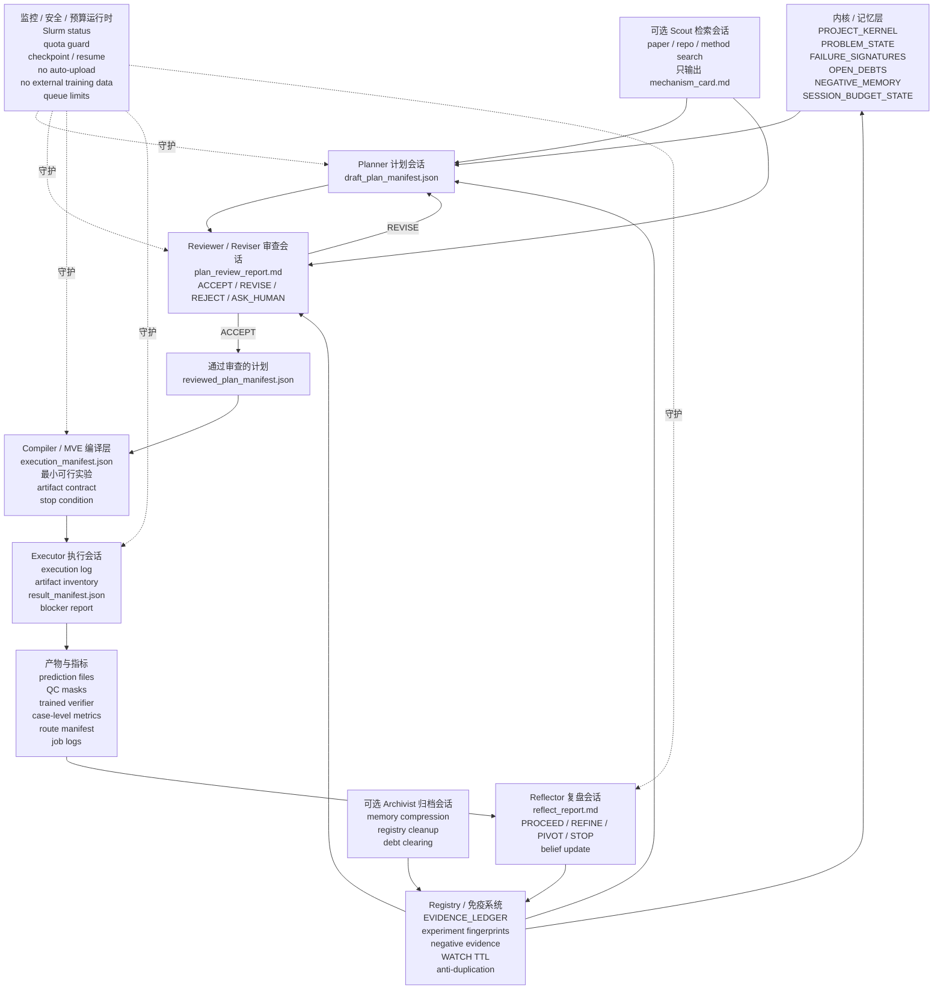

<h1 align="center">VibeResearch</h1>
<h3 align="center">面向长期研究流程的仓库级控制层</h3>

<p align="center">
  <strong>VibeResearch 将项目上下文、执行状态、证据链和报告集中保存在目标仓库的 <code>.vibe/</code> 目录中。</strong>
</p>

<p align="center">
  <a href="../README.md">English</a> |
  <a href="README_CN.md">中文</a>
</p>

<p align="center">
  
  
  
</p>

---

## 项目概览

VibeResearch 是一个本地优先的研究流程管理框架，面向已经存在的代码仓库。它会在目标仓库中创建 `.vibe/` 工作区，并把项目背景、想法、计划、运行记录、调度状态、实验依据、看板和每日日志保存在这里。

它的核心设计是把“判断”和“执行”分开。研究者或代码助手可以提出计划、假设、审阅意见和分析结论；VibeResearch 负责记录状态、校验接口、调度任务、跟踪来源、收集指标，并在信息不足或风险过高时阻止自动执行。

适合的场景包括：

- 持续多轮推进一个研究项目，并保留每轮决策依据；
- 将项目自己的训练、评估或推理脚本接入统一的编排层；
- 在本地或 Slurm 集群上运行实验，同时保留预算和就绪检查；
- 跟踪外部基线、scout 证据、内化决策、自有框架雏形和
  champion/challenger 优化过程；
- 归档旧失败状态，把它作为历史经验，而不是直接当成可信证据；
- 生成状态看板、每日记录和组会材料。

## VibeResearch OS 架构

VibeResearch OS 不是把某个外部自动科研框架包一层，也不是让一个
“超级 Codex” 从提出想法到执行再到宣布成功全部包办。它是一套面向
多个 Codex 会话协作的研究操作系统：用文件协议交接状态，用证据等级
判断进展，用负证据登记表防止旧路线换名重跑，用预算感知运行时
保证长时间运行时不会在关键阶段断掉。

它的目标不是让 agent 一直显得很忙，而是让每一轮研究都留下可审计的
证据、信念更新或负证据。一个动作如果不能从想法走到产物，再走到指标和决策，
就只能算准备或诊断，不能算真正进展。

### 设计原则

- 先拆职责，再谈自治。计划、审查、执行、复盘是不同职责，应该由不同
  Codex session 承担。
- 计划不能自己批准自己。Reviewer Session 是 Slurm、代码修改和高成本实验之前的正式闸门。
- artifact 不是终点。每个 artifact 都必须支持某类证据和某个信念更新。
- 失败路线不是普通日志，而是免疫记忆。后续相似计划必须说明新机制，否则应被拒绝。
- 预算和安全是运行时约束，不是 prompt 里的提醒。

### 层与运行角色

这里要区分两件事：层是架构概念，session 是运行角色。VibeResearch OS
采用八层结构：

1. Kernel / Memory Layer：保存项目目标、当前问题状态、失败签名、开放债务、负证据、安全边界和预算状态。
2. Planner Layer：提出候选计划和大胆机制。
3. Reviewer / Reviser Layer：执行前像导师或审稿人一样审查计划。
4. Compiler / MVE Layer：把通过审查的计划编译成最小可行实验和执行清单。
5. Executor Layer：由 Codex 改代码、写 runner、提交 Slurm，并产出 artifacts 和 metrics。
6. Monitor / Safety / Budget Layer：负责 Slurm 低成本监控、quota guard、checkpoint/resume、安全红线和队列上限。
7. Reflector / Belief Ratchet Layer：实验后解释结果，给出 `PROCEED`、`REFINE`、`PIVOT` 或 `STOP`。
8. Registry / Immune System Layer：记录实验 fingerprint、负证据、WATCH TTL 和反重复逻辑。

最小常驻配置是四个 Codex session：

- Planner Session：只写 `draft_plan_manifest.json`，不能改代码、不能提交 Slurm、不能批准自己的计划。
- Reviewer Session：只读、只审查、只 revise，写 `plan_review_report.md` 和
  `reviewed_plan_manifest.json`，输出 `ACCEPT`、`REVISE`、`REJECT` 或 `ASK_HUMAN`。
- Executor Session：只执行已经通过 review 的 manifest，可以改代码、跑脚本、提交 Slurm，
  但不能擅自改变科学方向，也不能把 smoke 当成果。
- Reflector Session：只读结果、解释指标、更新 memory 和 negative evidence，不能补跑实验。

可选 session 只有两个，按需临时打开：

- Scout Session：集中查论文、repo、leaderboard 或新方法，只能输出 `mechanism_card.md`，
  不能直接进入执行队列。
- Archivist Session：压缩长期 memory、整理 registry、清算 WATCH 债务，不参与实验执行。

Planner draft 通过 `vibe planner draft` 创建，并用 `vibe planner validate` 检查。
每个 draft 进入 review 前，必须写清 failure anchor、hypothesis、mechanism、
minimum experiment、expected artifact、expected belief update、compute cost、
risk、fallback 和 stop condition。
Reviewer 检查通过 `vibe reviewer review` 执行；只有 `ACCEPT` verdict 才会写出
`reviewed_plan_manifest.json` 交给 Compiler。
当 Reviewer 返回 `REVISE` 时，`vibe reviewer revision-packet` 生成结构化修改请求，
`vibe planner resubmit` 只能更新 packet 指定的 draft 字段。
通过 review 的 plan 使用 `vibe compiler compile` 编译，输出
`execution_manifest.json`、本地脚本草案、Slurm 草案、预期 artifact inventory、
evaluation command、stop condition 和 fallback command。
每个编译后的 manifest 都包含 MVE contract。`vibe mve validate` 在执行前检查
最小实验契约，`vibe mve promote-success` 在成功后记录下一层证据债务，而不是直接宣布主线成功。
Executor 通过 `vibe executor run` 执行通过审查的 `execution_manifest.json`，
写出 execution log、artifact inventory、result manifest 和 Reflector 可读的
result report；命令失败或缺少预期 artifact 时写 blocker report，不能把执行标记为完成。
`vibe executor guard` 可以只检查入口边界而不执行命令：review approval 一致性、
evidence-grade artifact、安全红线、stop condition、fallback command 和 failure report path。
执行后的解释由 `vibe reflector reflect` 完成。Reflector 读取 Executor result manifest、
artifact inventory、metric artifact、logs 和 MVE contract，然后写 `reflect_report.md`，
结论只能是 `PROCEED`、`REFINE`、`PIVOT`、`STOP` 或 `ASK_HUMAN`。MVE 成功只会生成
promotion debt，不会直接宣布主线成功；smoke/import 成功只能算 feasibility evidence。
`vibe ratchet apply` 把 reflection 写回分层 belief memory：feasibility、mechanism、
metric、robustness 和 negative evidence 分开记录，所以即使最终指标没涨，有价值的机制证据也会保留下来。
`vibe registry record` 和 `vibe registry check` 维护 immune system：计划会按 failure anchor、
mechanism、action type、artifact type、metrics、review/reflect decision 和 evidence type 生成 fingerprint。
旧实验换名重跑会被拦截，除非它带来新机制、新信息源、新 artifact 或新 evidence path。
`vibe debt list` 和 `vibe debt clear` 约束 WATCH/REFINE 债务：每个 open debt 都记录 missing
evidence、repayment MVE、TTL、promotion condition、pivot condition、stop condition 和 owner
session。过期 debt 会变成 STOP negative memory，或变成必须回到 Reviewer 的 PIVOT plan seed。
`vibe scout mechanism-card` 和 `vibe planner draft-from-card` 把外部知识先转成机制，再进入规划。
paper、repo、deep research note 和用户想法都必须先形成带 possible MVE 的 `mechanism_card.md`，
再由 Planner/Reviewer/Compiler 转成执行清单；clone 或 install 本身不能作为实验目标。



### 标准闭环

标准流程不是 “Codex 生成计划后自己执行”。完整闭环应该是：

1. Problem Kernel 固化目标、失败签名、开放债务、负证据、预算状态和安全边界。
2. Planner Session 读取这些状态，写出 `draft_plan_manifest.json`。每个候选都要说明
   失败锚点、假设、机制、预期产物、预期信念更新、最小实验、成本、fallback 和 stop condition。
3. Reviewer Session 读取 draft plan 和 registry，写出 `plan_review_report.md`，
   输出 `ACCEPT`、`REVISE`、`REJECT` 或 `ASK_HUMAN`。只有被接受的计划才会成为
   `reviewed_plan_manifest.json`。
4. Compiler / MVE Layer 把 reviewed plan 转成 `execution_manifest.json`。
5. Executor Session 执行 accepted manifest，记录命令 provenance、artifact inventory、
   result report 和 blocker report，并且不能改写已经审查过的科学决策。
6. Monitor / Safety / Budget Runtime 用低成本方式监控作业，守住队列、预算和安全边界，并在中断前写 checkpoint。
7. Reflector Session 读取结果，写 `reflect_report.md`，给出 `PROCEED`、`REFINE`、`PIVOT` 或 `STOP`。
8. Registry 和 memory 更新后，下一轮 Planner 从新的信念状态继续，而不是从空白 prompt 重新开始。

这里有两次 revise。执行前 revise 由 Reviewer 完成，用来避免浪费算力；执行后 revise
由 Reflector 完成，用来更新研究信念。

### 共享文件协议

不同 session 之间只通过文件交接，不靠聊天记录口头理解。安装后的框架把这些
kernel 文件放在 `.vibe/kernel/` 下，并用 `vibe kernel` 命令负责初始化、检查、
追加证据和校验角色边界：

- `PROJECT_KERNEL.md`：长期目标和绝对边界。
- `PROBLEM_STATE.md`：当前问题状态。
- `FAILURE_SIGNATURES.md`：当前重点攻击的失败模式。
- `OPEN_DEBTS.md`：未清研究债务、WATCH 和下一步证据要求。
- `NEGATIVE_MEMORY.md`：不应重复的失败机制和路线。
- `EVIDENCE_LEDGER.jsonl`：追加记录每轮证据、决策、artifact pointer 和信念更新。
- `SESSION_BUDGET_STATE.json`：Codex 5h quota、weekly quota、active session、running job、resume command 和 checkpoint。
- `draft_plan_manifest.json`：Planner 写入。
- `plan_review_report.md` 和 `reviewed_plan_manifest.json`：Reviewer 写入。
- `execution_manifest.json`：Compiler 写入。
- `artifact_inventory.json`、metrics CSV 和 job logs：Executor 写入。
- `reflect_report.md`：Reflector 写入。

内核命令面保持很小：

- `vibe kernel init`：创建或修复必需 kernel 文件。
- `vibe kernel status`：确认新 session 能从文件恢复状态。
- `vibe kernel roles`：列出 Planner、Reviewer、Compiler、Executor、Reflector、
  Scout 和 Archivist 的角色边界。
- `vibe kernel check-role`：在修改文件或执行动作前校验角色动作、输出路径和预算状态。
- `vibe kernel record-evidence`：追加一条可审计 evidence ledger 记录。
- `vibe kernel check-protocol`：发现缺失文件和单 session 自闭环越权。

### 反偷懒规则

VibeResearch 不靠一句 “不要偷懒” 来约束系统，而是让偷懒动作无法晋级：

- 没有失败锚点的 plan 不能进入 Reviewer。
- 没有预期产物和预期信念更新的 plan 不能被 `ACCEPT`。
- repo 或 paper 如果不能转成 mechanism card 和 MVE，就不能进入执行队列。
- smoke、import、clone、metadata、cache、readiness check 只能算 diagnostic evidence，
  不能算 progress evidence。
- 每个 WATCH 都必须写明下一步要还的债和 TTL；过期不还就 `STOP` 或 `PIVOT`。
- 旧失败实验换名重跑会被 Registry 拦截，除非它引入新机制、新信息源、新 artifact 或新 evidence path。
- one-case positive 不能直接跳 submission，必须经过 subset、fold0，再到 multi-fold 或 packaging。

### 证据升级

证据分层如下：

- 可运行性证据（feasibility evidence）：证明能不能跑，例如 import/load 或 shape check。
- 机制证据（mechanism evidence）：证明机制可能有效，例如 one-case component veto。
- 指标证据（metric evidence）：证明指标有变化，例如 subset 或 fold0 的 Dice/HD95。
- 鲁棒性证据（robustness evidence）：证明跨 case、center、fold 或 protected metrics 稳定。
- 负证据（negative evidence）：证明哪些路线不该再做。

默认升级路径是 feasibility -> one-case -> subset -> fold0 -> multi-fold 或 packaging。
系统不能从 smoke 直接宣称成功。

### 预算感知运行时

所有 Codex session 都必须有 5-hour quota 意识。每个 session 在启动、长任务、revise、
reflection、sleep 或 resume 前，都要读取 `SESSION_BUDGET_STATE.json`。
`vibe session-budget init` 创建共享状态，`vibe session-budget refresh` 记录人工观察到的
`codex --no-alt-screen` `/status` quota 文本，`vibe session-budget guard --phase PLAN|REVIEW|COMPILE|EXECUTE|REFLECT|SLEEP`
判断下一阶段是否允许进入。

当 5h quota 低于 20% 时，只允许收尾、写 checkpoint、提交已经准备好的短 job、
整理报告或更新 memory。当 5h quota 低于 10% 时，必须停止新推理，写 `RESUME.md`，
记录当前阶段、下一步命令、未完成债务、job id 和必须避免重复的动作，然后 sleep
或退出等待 renew。`vibe session-budget checkpoint --phase ...` 用来写这份恢复状态。

低 quota 时，Executor 优先级最高，因为它要保存工程现场；Reflector 次之，因为它要保存
结果解释；Planner 和 Reviewer 应暂停。Slurm 长任务期间不应让 Codex 反复读日志，
而应使用 zero-cost monitor 等待作业结束，并留下 resume command。
`vibe session-budget wait-mode --wait-type slurm-job` 记录 job 轮询，
`--wait-type quota-wait` 则记录基于 `wait_until_budget_reset.sh` 的 quota renew 等待。

### Codex 的角色

Codex 可以扮演 Planner、Reviewer、Executor 或 Reflector，但必须分成不同 session，
并遵守不同权限。Codex 最适合做 Executor，因为它擅长读代码、改代码、写脚本、修报错、
提交 Slurm 和整理 artifacts。Codex 也可以做 Reviewer，但必须是只读 Reviewer session。
同一个 session 不能自己提出计划、自己批准、自己执行、最后自己宣布成功。

Reviewer 是整套系统最重要的防空转闸门。没有 Reviewer，系统很容易把 “能做”
误判成 “值得做”。

### 版本路线

0.12 之后的路线是 VibeResearch 自己的 OS 架构，不是对外部 auto-research 框架的简单包装：

- 0.13：session-oriented kernel 和共享文件协议。
- 0.14：Planner、Reviewer 和 revision loop。
- 0.15：Compiler 和 MVE contract。
- 0.16.0-0.16.1：Executor session 和 boundary guard。
- 0.16.2：Budget-Aware Session Runtime。
- 0.17：Reflector 和 Belief Ratchet。
- 0.18：Research Registry、Immune System 和 WATCH TTL。
- 0.19：Knowledge-to-Experiment pipeline。
- 0.20：VibeResearch OS Beta 和 Anti-Stall Benchmark。

### 最小运行流程

1. 打开 Planner Codex session，只允许生成 `draft_plan_manifest.json`。
2. 打开 Reviewer Codex session，只允许生成 `plan_review_report.md` 和
   `reviewed_plan_manifest.json`。
3. 打开 Executor Codex session，只允许执行通过 review 的 `execution_manifest.json`。
4. 打开 Reflector Codex session，只读结果，并更新 `reflect_report.md`、
   `NEGATIVE_MEMORY.md`、`OPEN_DEBTS.md` 和 `EVIDENCE_LEDGER.jsonl`。
5. 如果需要查新 paper、repo 或方法，再临时打开 Scout Session。
6. 如果 memory 或 registry 变乱，再临时打开 Archivist Session。

## 安装

从 GitHub 克隆并安装：

```bash
git clone https://github.com/YuukiAS/VibeResearch.git
cd VibeResearch
python -m pip install -e .
```

确认命令可用：

```bash
vibe --help
vibe bootstrap --help
```

## 快速开始

进入目标研究仓库并初始化：

```bash
cd /path/to/research-repo
vibe init \
  --goal "在固定评估协议下提升验证表现" \
  --background "项目背景、数据、指标、算力限制和当前基线"
```

GPU/Slurm 资源策略会默认初始化。`vibe init` 会写入 `.vibe/resources/` 和
`.vibe/config.detected.yaml`，但 VibeResearch 不会根据 `a100-gpu`、`volta-gpu`
这样的名字推断具体 GPU 型号。接入时应先查看目标集群，再把确认后的策略写入初始化参数：

```bash
sinfo -h -o "%P %G"

vibe init \
  --goal "..." \
  --background "..." \
  --preferred-partition lab-gpu \
  --fallback-partition a100-gpu \
  --partition-gres 'a100-gpu=gpu:nvidia_a100-pcie-40gb:{gpu}' \
  --max-pending-start-plus-run-hours 12 \
  --max-run-hours 8 \
  --max-epochs 120 \
  --delivery-max-run-hours 72 \
  --delivery-max-epochs 5000
```

这里的分区名只是示例。实际应使用目标机器上 `sinfo` 返回的名称和 GRES 写法。
如果项目只使用本地或 CPU，也应该在资源问题中明确记录，而不是跳过资源初始化。
普通运行时长限制用于探索阶段实验；交付运行时长限制只用于显式标记为最终交付或提交阶段的 run。

查看当前状态：

```bash
vibe config validate
vibe status
vibe next
```

如果不希望在目标仓库根目录生成状态镜像文件，可以使用：

```bash
vibe init --no-root-portal --goal "..." --background "..."
```

## 让 Codex 代为接入

如果希望把安装和初始化交给 Codex，而不是手动照 README 执行命令，可以把下面文件中的提示交给 Codex：

```text
docs/bootstrap/CODEX_ONBOARDING_PROMPT_CN.md
```

这份提示会要求 Codex 从 GitHub 克隆 VibeResearch、安装框架、询问目标仓库和项目目标/背景、运行初始化流程、整理阻塞问题、把你的回答写入目标仓库的 `.vibe/` 文件，并继续执行 `bootstrap resume`，直到最小安全能力就绪或明确阻塞。

## 状态目录

VibeResearch 的持久状态都在 `.vibe/` 下：

```text
.vibe/
  project/                 项目 brief 和初始化上下文
  config.yaml              框架配置
  adapter.yaml             项目能力声明
  adapter_questions.yaml   激活前需要回答的问题
  script_bootstrap_plan.md 脚本接入计划
  scripts/                 项目自己维护的封装脚本
  contract_tests/          能力接口测试结果
  policies/                预算、阶段门控和自治策略
  state/                   控制状态
  cycles/                  cycle 级计划和决策
  runs/                    运行清单和来源记录
  scheduler/               队列和预算状态
  ideas/                   想法池
  research/                假设、实验、证据和决策
  memos/                   每日记录
  dashboard/               看板数据导出
  site/                    静态看板
  reports/                 组会和开发报告
  portal/                  根目录镜像文件的来源
```

根目录的 `RUN.md`、`VIBE_STATUS.md`、`VIBE_TODO.md`、`VIBE_TIMELINE.md`、`VIBE_LEADERBOARD.md` 只是生成出来的镜像文件，不是权威状态。权威状态始终在 `.vibe/` 下。

重新生成根目录镜像：

```bash
vibe portal build
```

默认不会修改根目录已有的 `AGENTS.md`。只有显式要求时才会安装片段：

```bash
vibe init --install-agents-snippet --goal "..." --background "..."
```

## 初始化与就绪检查

Bootstrap 是把已有项目接入 VibeResearch 的初始化流程。它会读取项目文件，生成 adapter 草案和脚本接入计划，写入策略文件，记录未回答的问题，运行校验，并且只激活通过接口测试的能力。

```bash
vibe bootstrap init --goal "..." --background "..." --memo-language zh-CN
vibe bootstrap run
vibe bootstrap status
vibe bootstrap doctor
```

如果 bootstrap 因信息不足而停止，先回答或修改 `.vibe/` 下生成的文件，然后继续：

```bash
vibe bootstrap resume
```

主要输出：

```text
.vibe/bootstrap/state.json
.vibe/bootstrap/sessions/<session_id>.json
.vibe/bootstrap/readiness_report.md
.vibe/bootstrap/readiness.json
.vibe/script_readiness.json
.vibe/dashboard/readiness_export.json
```

就绪检查采用保守策略：缺预算策略时不能提交队列；缺自治策略时不能自动执行；缺阶段门控时不能晋升；缺受保护指标时不能自动进入更高阶段。

Bootstrap 和 adapter 发现流程使用有上限的文件遍历器。`.git/`、`.vibe/`、`.vibe_dogfood/`、`data/`、`results/`、`models/`、`logs/`、`envs/`、`external_supervisors/` 等运行期或重目录会在进入前跳过，避免初始化时扫进大量中间产物。项目可以在 `.vibe/config.yaml` 中调整：

```yaml
discovery:
  skip_dirs: [scratch, downloads]
  max_files: 200
  max_dirs: 1000
  max_seconds: 5
```

更完整的接入、本地试运行、旧状态归档和就绪门控说明见 [Bootstrap 指南](bootstrap/README_CN.md)。

## Adapter 接入

Adapter 是项目自己的能力声明，用来说明 VibeResearch 可以做什么。真正的训练、评估、推理和提交逻辑仍然属于下游项目，由 `.vibe/scripts/` 中的薄封装脚本调用。VibeResearch 主框架不保存项目特定执行逻辑。

常用命令：

```bash
vibe adapter discover
vibe adapter draft
vibe adapter ask
vibe script bootstrap --plan
vibe adapter lint
vibe adapter doctor
```

只有 `active` 能力可以被选中执行。`draft`、`candidate` 或阻塞状态的能力只会出现在报告中，不会自动运行。能力必须先通过接口测试才能激活：

```bash
vibe adapter contract-test metrics_export
vibe adapter activate metrics_export --confirm "reviewed by project owner"
```

`.vibe/scripts/` 中生成的封装脚本默认是草案，不能直接视为可信。通常应先建立评估或指标导出能力，再考虑训练自动化；GPU 和长任务能力必须有明确的资源策略。

Instrumentation readiness 和真实实验 readiness 是两件事。环境探针、数据探针和 baseline inventory 可以验证项目表面，但不代表已经可以推进方法或评估实验。真实实验前需要补齐评估命令、指标格式、baseline/proxy、后端策略、collector 和项目安全规则：

```bash
vibe adapter real-gaps
vibe experiment real-progress
```

## 有边界的研究管理

研究管理层用来记录假设、实验、证据、决策、预算和每日记录。它帮助项目持续迭代研究想法，同时保留每个结论背后的证据链。

```bash
vibe research init --goal "..." --background "..." --memo-language zh-CN
vibe hypothesis create "try a calibrated evaluator" --stage analysis
vibe experiment create hyp_001 --design "calibration smoke" --stage analysis --capability metrics_export
vibe experiment analyze exp_001 --trusted --schema-valid --summary "primary improved without guardrail regression"
vibe memory build
vibe portfolio plan
vibe portfolio schedule
vibe budget status
vibe memo daily --language zh-CN
vibe dashboard export-research
```

晋升需要可信且符合指标格式的证据，并且受保护指标不能出现不可接受的回退。停止假设需要可信负证据或明确的用户决定。同构重复实验、未知成本、缺脚本、缺指标格式和缺 `active` 能力都会在执行前被阻止。

## 谱系、Scout 与自有框架

VibeResearch 可以记录项目如何从外部工具逐步走向自有实现。它会区分几类不同状态：直接调用外部仓库、封装外部能力、受外部想法启发、正在内部 shadow 复现，以及可以作为 owned core 候选的自有实现。这些状态不能混在一起。

常用谱系和内化命令：

```bash
vibe lineage add-external-asset --asset-type repo --name baseline_repo --source https://example.org/repo
vibe lineage link --source-id asset_001 --target-id hyp_001 --relation-type supports
vibe internalization propose --title "owned evaluator" --external-baseline-asset-id asset_001 --downstream-src-target src/owned_eval
vibe internalization readiness proposal_001
vibe internalization memory
```

Scout 查到的资料必须先结构化，才能影响实验或内化决策。框架会记录 relevance、specificity、actionability、novelty、credibility、实现细节和 failure-mode fit。背景资料会被保留，但不会自动变成实验依据。

```bash
vibe scout query-context
vibe scout add-finding --title "method note" --source https://example.org/paper --summary "..."
vibe scout triage scout_001
vibe scout claim --finding-id scout_001 --claim "..."
vibe scout audit
```

Dual-track portfolio 用来让外部路线和内部路线保持可比较：

```bash
vibe portfolio track-plan --experiment-id exp_001 --track external
vibe portfolio track-plan --experiment-id exp_002 --track internal --internalization-level shadow_internal
vibe portfolio compare-plan --track-record-id track_002
vibe portfolio track-audit --track-record-id track_002 --target-level hybrid_internal
vibe portfolio track-memo
```

Owned framework alpha 必须来自已经通过审查的 proposal，并且会把项目自有脚手架写入下游仓库。VibeResearch 只提供通用的生成、审计、接口测试和 adapter 机制，不把项目特定模型逻辑写进主框架。

```bash
vibe owned scaffold proposal_001 --framework-name owned_eval
vibe owned contract owned_eval
vibe owned shadow-plan proposal_001
vibe owned audit owned_eval --proposal-id proposal_001
```

当 owned alpha 已经存在后，后续优化应当按 champion/challenger 推进，而不是无边界地扫参数：

```bash
vibe optimize champion --stage shadow --candidate-id owned_eval --evidence-id ev_001 --budget-policy-ok --rationale "trusted comparison"
vibe optimize challenger --stage shadow --candidate-id owned_eval_v2 --against-champion-id owned_eval
vibe optimize ablation --candidate-id owned_eval_v2 --ablation-key loss_a --hypothesis "..." --expected-effect "..." --metrics-target primary --rollback-plan "..."
vibe optimize regression --candidate-id owned_eval_v2 --stage shadow
vibe optimize external-deemphasis --proposed-external-ratio 0.4 --policy-allowed --rationale "owned candidate is stable"
```

## 从决策到执行

VibeResearch 不会直接把自由文本计划变成实验。它先把结构化决策编译为资源计划，再生成运行清单。

```text
revised_plan.md
  -> decision.json
  -> project adapter
  -> resource_plan.yaml
  -> 运行清单
  -> 通过格式和来源检查后才成为可信指标
```

常用命令：

```bash
vibe validate-decision c001
vibe decision show c001
vibe decision write c001 --type launch_gpu_gate --action "run configured adapter task"
vibe decision write-block c001 --reason "adapter missing"
vibe compile-decision c001
vibe validate-resource-plan c001
```

重复收集同类证据、缺失指标或默认 0.0 指标会被标记为阻塞或不可信，不会更新可信排行榜状态。

## 想法池与深入调研

原始输入会进入收件箱；整理后的研究想法会进入想法池，并获得稳定 ID。

```bash
vibe idea "比较两条路线级方法"
vibe ideas list
vibe ideas triage
vibe ideas promote idea_001
vibe ideas reject idea_001 --reason "暂时超出范围"
vibe ideas archive idea_001
```

深入调研需要显式触发。把想法标记为需要深入调研，并不会自动开始调研。

```bash
vibe deep-request-from-idea idea_001
vibe ingest-deep-research dr001_idea_001 --kind science
vibe ingest-deep-research dr001_idea_001 --kind workflow
vibe ingest-deep-research dr001_idea_001 --kind repo
vibe ingest-deep-research dr001_idea_001 --kind benchmark
```

支持 Markdown 和 PDF 报告。PDF 文本抽取优先使用 PyMuPDF，不做 OCR。

## 调度与 Slurm

调度器是确定性的，并且会遵守预算。未通过预演、清单无效、依赖未满足、超预算或被审阅阻塞的任务都不会提交。

探测本地环境：

```bash
vibe config detect
```

集群相关配置通常位于：

```text
.vibe/config.yaml
.vibe/config.local.yaml
.vibe/scheduler/budget.yaml
```

提交并监控：

```bash
vibe submit-queue --backend slurm
vibe monitor --loop --auto-next
```

如果配置了 preferred 和 fallback Slurm 分区，提交时默认使用 preferred 分区。
`sinfo` 显示 fallback 可用，并不足以绕过 preferred 分区。只有等待策略证据表明 preferred 分区对当前 run 的预算来说明显太慢时，才会选择 fallback。提交记录会区分 `preferred_partition_selected` 和 `fallback_selected_after_wait_policy`。

如果发现一个还未开始运行的任务落在 fallback 分区，而策略要求回到 preferred 分区，dry-run 审批材料会给出可直接执行的命令：

```bash
vibe scheduler-requeue-fallback
vibe scheduler-requeue-fallback --run-id r001 --execute --to-preferred
```

本地开发可以使用模拟提交：

```bash
vibe submit-queue --dry
```

## 看板与报告

构建静态只读看板：

```bash
vibe dashboard build
```

本地查看：

```bash
vibe dashboard serve --host 127.0.0.1 --port 8765
```

导出组会材料：

```bash
vibe export-meeting
vibe export-meeting --date 20260529
```

输出目录：

```text
.vibe/reports/meeting/YYYYMMDD/
```

## 本地开发

运行测试：

```bash
python -m pytest -q
```

测试使用离线 Codex 和本地模拟调度路径，不需要 Codex 登录、GPU、Slurm 集群或网络。

运行内置冒烟流程：

```bash
vibe dogfood
```

## 设计原则

- `.vibe/` 是权威状态目录。
- 根目录状态文件只是生成镜像。
- 项目特定执行逻辑留在下游仓库。
- 能力必须明确声明、经过审查，并通过接口测试后才能使用。
- 长任务监控不依赖语言模型调用。
- 旧结果只是历史上下文，只有通过当前 adapter、指标格式、产物和来源规则后才可能成为可信证据。
